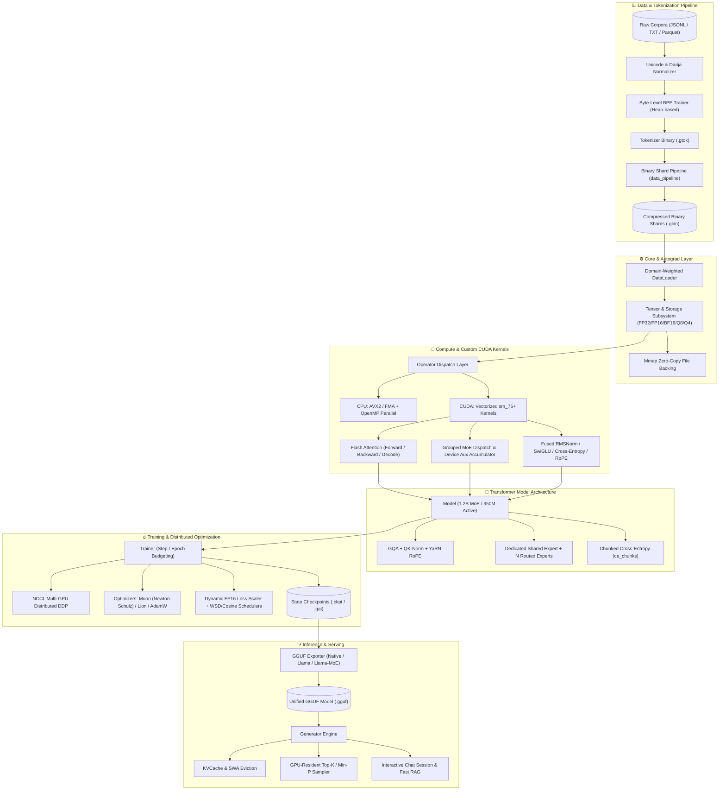

# 🌟 Ghassan AI (`Ghassan_v1_pro`)
### High-Performance Standalone C++20 & CUDA Mixture of Experts (MoE) LLM Engine

<p align="center">
  
  
  
  
  
  
</p>

---

## 📖 Overview

**Ghassan AI (`Ghassan_v1_pro`)** is a state-of-the-art, zero-external-dependency Large Language Model training and inference engine written entirely in **C++20** and **pure CUDA / cuBLAS**. Built from bare metal without PyTorch, LibTorch, ONNX, or third-party tensor libraries, it delivers ultra-low overhead, predictable memory allocation, and maximum hardware saturation.

Tailored for Moroccan Darija, Arabic, and multilingual instruction reasoning, it implements modern LLM architecture breakthroughs including **DeepSeek-style Mixture of Experts (MoE)** with dedicated Shared Experts, **Flash-style Tiled Online Softmax Attention**, **Muon (Newton-Schulz Orthogonalization)** and **Lion** optimizers, **Chunked Cross-Entropy**, and **GGUF v3** serialization.

---

## 🏛️ Architectural Overview



---

## 🔬 Core Technical Innovations

### 1. DeepSeek-Style Mixture of Experts (MoE)
* **Routed + Shared Expert:** Combines $N$ routed experts (selecting Top-$K$) with 1 permanently active Shared Expert, ensuring consistent baseline representations.
* **Aux-Loss-Free Router Bias:** Dynamic EMA load-balancing bias steers token routing during training without corrupting task loss gradients.
* **Device-Side Aux Loss Accumulator:** Device-resident auxiliary histogram accumulation eliminates expensive per-layer GPU-to-CPU host synchronizations.
* **Contention-Free Backward Pass:** Permutation-based slot binning avoids atomic collisions during token gradient accumulation.

### 2. Flash-Style Tiled Attention & Decode Kernels
* **Online Softmax Scaling:** Maintains running maximum $m$ and sum of exponentials $d$ within shared memory tiles ($16 \times 16 \times 16$), eliminating numerical overflow on long contexts.
$$\text{Scale Update: } m_{\text{new}} = \max(m_{\text{old}}, x_i), \quad d_{\text{new}} = d_{\text{old}} e^{m_{\text{old}} - m_{\text{new}}} + e^{x_i - m_{\text{new}}}$$
* **Sliding Window Attention (SWA):** Configurable local attention window bounded by $W$ positions.
* **Single-Token Decode Kernel:** Vectorized float4 memory access with cross-warp reductions for single-token autoregressive generation.

### 3. Advanced Optimizers: Muon, Lion & AdamW
* **Muon (Matrix Update Orthogonalization):** Applies right-multiplied Newton-Schulz iterations on 2D weight matrices to enforce orthogonal updates:
$$X_0 = \frac{G}{\|G\|_F}, \quad X_{k+1} = 1.5 X_k - 0.5 X_k (X_k^T X_k)$$
Accelerates representation learning by $1.5\times - 2\times$ over AdamW.
* **Lion:** Evolutionary sign-momentum optimizer requiring only 1 momentum state per parameter, saving 50% optimizer VRAM vs AdamW.
* **Fused Multi-Tensor Gradient Clipping:** Computes global $L_2$ gradient norms in a single reduction pass across all parameters.

### 4. Memory Optimization for Tesla T4 (16GB VRAM)
* **Chunked Cross-Entropy (`ce_chunks`):** Slices $[N, V]$ logit computation into vocabulary blocks, dropping peak VRAM from $>1.1\text{ GB}$ to $<260\text{ MB}$.
* **Monotonic Workspace Pools:** Pre-allocated memory arenas prevent per-step `cudaMalloc` fragmentation.
* **Transient Flash Backward Buffers:** Intermediate attention probabilities are materialized layer-by-layer into a shared transient buffer instead of allocating persistent graphs.

---

## 📂 Codebase Directory Structure

```
Ghassan AI model/
├── CMakeLists.txt              # CMake build script (MSVC, GCC, Clang, CUDA sm_75+, OpenMP)
├── configs/                    # Production YAML recipes
│   ├── pretrain_1b_moe.yaml    # 1.2B MoE pretraining config
│   ├── sft_darija.yaml         # Moroccan Darija SFT recipe
│   └── test_cpu.yaml           # Fast CPU smoke test configuration
├── core/                       # Core engine primitives
│   ├── common.h / .cpp         # Logging, timing, string formatting, thread utilities
│   ├── config.h / .cpp         # Minimal YAML parser with strict key validation
│   ├── device.h / .cpp         # Device memory management (aligned CPU / CUDA)
│   ├── dtype.h / .cpp          # DType enums, FP16/BF16/Q8/Q4 conversion math
│   ├── mmap.h / .cpp           # Zero-copy memory-mapped file reader (Windows/POSIX)
│   ├── ops.h / .cpp            # Polymorphic operator dispatch interface
│   ├── ops_cpu.h / .cpp        # CPU kernels (AVX2/FMA + OpenMP)
│   ├── ops_moe.cpp             # CPU reference MoE forward & backward kernels
│   └── tensor.h / .cpp         # Storage & Tensor abstractions with stride & view safety
├── cuda/                       # CUDA kernels & GPU runtime
│   ├── attention.cu            # Flash-style tiled attention forward/backward/decode
│   ├── cuda_ops.h              # CUDA operator declarations
│   ├── cuda_utils.h / .cu      # Device query, memory tracking, cuBLAS setup
│   ├── kernels.cu              # Fused RMSNorm, SwiGLU, Cross-Entropy, RoPE, Optimizers
│   └── moe.cu                  # Grouped MoE dispatch, slot binning, expert GEMMs
├── model/                      # Model definition & Autograd
│   ├── model.h / .cpp          # Transformer MoE architecture, activations, autograd
├── training/                   # Training loop & distributed infrastructure
│   ├── checkpoint.h / .cpp     # Model, optimizer & dataloader state serialization
│   ├── dataloader.h / .cpp     # Binary shard reader (.gbin) with domain mixing
│   ├── distributed.h / .cpp    # Multi-GPU NCCL / DDP communication wrapper
│   ├── optimizer.h / .cpp      # AdamW, Lion, and Muon (Newton-Schulz) optimizers
│   ├── scheduler.h             # Warmup-Cosine & Warmup-Stable-Decay (WSD) schedulers
│   └── trainer.h / .cpp        # Full training orchestrator with loss scaling
├── inference/                  # High-speed inference & serving
│   ├── chat.h / .cpp           # Multi-turn chat session with RAG fast-path
│   ├── generator.h / .cpp      # Autoregressive generation (batched prefill + decode)
│   ├── kv_cache.h / .cpp       # Contiguous KV cache with sliding window eviction
│   └── sampler.h / .cpp        # Fast GPU-resident & CPU sampling (Top-K, Min-P, penalties)
├── tokenizer/                  # Byte-level BPE & Unicode normalization
│   ├── bpe_trainer.h / .cpp    # Heap-based BPE vocabulary trainer
│   ├── chat_template.h / .cpp  # Chat formatting & SFT loss mask generation
│   ├── normalizer.h / .cpp     # Moroccan Darija & Arabic Unicode normalizer
│   └── tokenizer.h / .cpp      # Byte-fallback BPE encoder/decoder with streaming
├── format/                     # Serialization & formats
│   ├── gai_format.h / .cpp     # Native compact binary format (.gai)
│   └── gguf_format.h / .cpp    # Standard GGUF v3 writer & reader (llama.cpp interop)
├── quantization/               # Quantization algorithms
│   └── quantize.h / .cpp       # Q8_0, Q4_0, and Q4_1 quantization routines
├── tools/                      # Executable CLI entry points
│   ├── benchmark.cpp           # GEMM & Attention benchmark harness
│   ├── corpus_stats_main.cpp   # Dataset character, token, and vocabulary statistics
│   ├── data_pipeline_main.cpp  # Raw text to binary shard converter (.gbin)
│   ├── main.cpp                # Main CLI (`ghassan-ai` chat, generate, quantize, etc.)
│   ├── train_main.cpp          # Training CLI (`gai_train`)
│   └── train_tokenizer_main.cpp# Tokenizer trainer CLI (`train_tokenizer`)
└── tests/                      # Automated test suite
    ├── test_configs.cpp        # YAML recipe and parser validation
    ├── test_gradcheck.cpp      # Numerical vs analytical gradient check
    └── test_regressions.cpp    # Edge case regression tests
```

---

## ⚡ Tesla T4 (16GB VRAM) Memory Budget

The engine is engineered to fit within a single 16GB NVIDIA Tesla T4 GPU during 1.2B MoE pretraining and SFT without out-of-memory errors:

| Memory Component | Allocation / Configuration | Memory (MiB) |
| :--- | :--- | :--- |
| **Model Weights (FP16)** | $\approx 1.2\text{B total parameters}$ ($350\text{M active}$) | ~2,400 MiB |
| **Master Weights + Gradients** | FP16/FP32 parameter buffers | ~4,800 MiB |
| **Optimizer States (Lion)** | 1 momentum buffer per parameter | ~2,400 MiB |
| **Activations (Chunked CE)** | $\text{Batch}=2, \text{Seq}=2048, \text{ce\_chunks}=4$ | ~3,200 MiB |
| **Transient & Workspace Pools** | cuBLAS, Attention & MoE scratch | ~1,000 MiB |
| **CUDA Runtime & Reserve** | Driver context & safety margin | ~1,560 MiB |
| **Total Peak Footprint** | **Fully within 16GB budget** | **~13,800 / 15,360 MiB** |

---

## 🛠️ Build & Installation

### Prerequisites
* **C++ Compiler:** MSVC 2022 (Windows) or GCC 11+ / Clang 14+ (Linux/macOS) with C++20 support.
* **Build System:** CMake 3.20+
* **CUDA Toolkit (Optional for GPU):** CUDA 11.8+ / 12.x (sm_75+ architecture).
* **OpenMP:** Supported and enabled automatically.

### 1. Build on Windows (MSVC)
```powershell
# Configure CMake
cmake -B build -S . -DGAI_BUILD_TESTS=ON

# Compile Release binaries
cmake --build build --config Release --parallel
```

### 2. Build on Linux / Kaggle / Cloud (GCC & CUDA)
```bash
mkdir -p build && cd build
cmake .. -DCMAKE_BUILD_TYPE=Release -DGAI_ENABLE_CUDA=ON -DCMAKE_CUDA_ARCHITECTURES=75
make -j$(nproc)
```

---

## 🚀 Quickstart & Usage

### 1. Interactive Chat (GGUF Model)
```bash
./build/bin/Release/ghassan-ai chat --model ghassan_1b_moe.gguf --temp 0.7 --top-p 0.92
```

### 2. Single-Prompt Generation
```bash
./build/bin/Release/ghassan-ai generate \
    --model ghassan_1b_moe.gguf \
    --prompt "شنو هو الذكاء الاصطناعي وكيفاش كيخدم؟" \
    --max-tokens 256 \
    --temp 0.8
```

### 3. Model Quantization (Q8_0 / Q4_0)
```bash
# Quantize full FP16 model to 4-bit Q4_0 for instant low-RAM inference
./build/bin/Release/ghassan-ai quantize \
    --model ghassan_fp16.gguf \
    --out ghassan_q4_0.gguf \
    --profile q4_0
```

### 4. Training a Tokenizer
```bash
./build/bin/Release/train_tokenizer \
    --input corpus.txt \
    --vocab-size 32000 \
    --out tokenizer.gtok \
    --normalize-darija 1
```

### 5. Preprocessing Data into Binary Shards (.gbin)
```bash
./build/bin/Release/data_pipeline \
    --input dataset.jsonl \
    --tokenizer tokenizer.gtok \
    --out-dir ./shards \
    --seq-len 2048 \
    --workers 8
```

### 6. Pretraining / Fine-Tuning (`gai_train`)
```bash
# Run training with configuration recipe
./build/bin/Release/gai_train --config configs/pretrain_1b_moe.yaml
```

---

## 🧪 Verification & Test Suite

The engine includes an analytical test harness ensuring numerical gradient fidelity and stability:

```bash
# Run regression tests
./build/bin/Release/test_regressions

# Run YAML and recipe validation tests
./build/bin/Release/test_configs

# Run analytical vs numerical gradient checks
./build/bin/Release/test_gradcheck
```

---

## 📄 License & Attribution

Developed with precision for high-performance AI research.  
Created by **Mohammed Amine Rhassan** (`Ghassan AI`).
