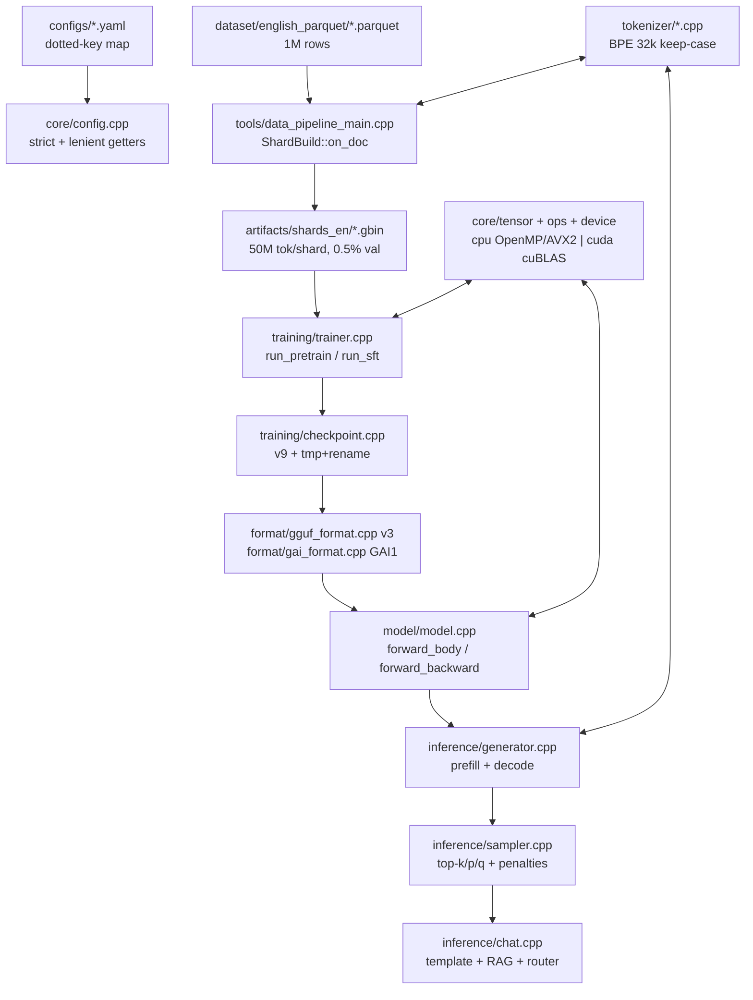
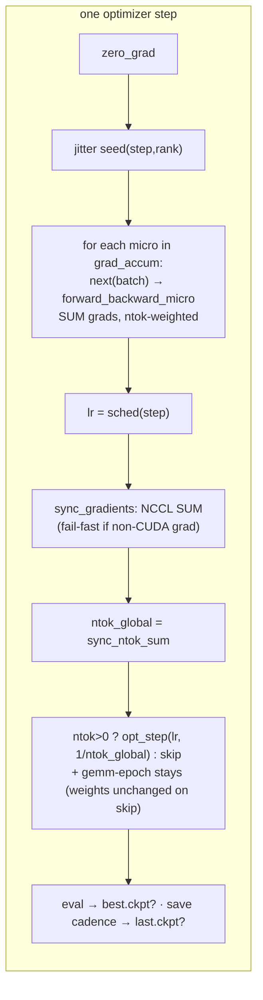
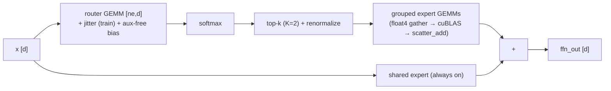

<div align="center">

# 🧠 Ghassan v1 Pro
### Sovereign English LLM Engine — from Parquet Lake to GGUF Chat in Pure C++ / CUDA

**480M MoE (204M active) • 1B MoE (336M active) • GQA • SwiGLU-MoE • QK-Norm • RoPE/YaRN • Lion/AdamW • NCCL-DDP • T4-Native**

[](CMakeLists.txt)
[](cuda/)
[](CMakeLists.txt)
[](tests/)
[](dataset/english_parquet/manifest.json)
[](#-fix-log--commit-5b698b0)

*Zero Python at runtime. CPU everywhere, CUDA when available. One repo builds tokenizer → shards → training → chat → GGUF.*

[🏗 Architecture](#-1-architecture--system-map) • [📁 File Tree](#-2-repository-map--شجرة-الملفات) • [🔬 Module Audit](#-3-module-by-module-audit-ملف-بملف) • [💾 Data](#-4-data--dataset-system) • [🚀 Quickstart](#-6-build--run) • [🩺 Senior Audit](#-10-senior-audit--fix-log)

</div>

---

## 📖 Table of Contents

- [0. What is this?](#-0-what-is-ghassan-v1-pro)
- [0.1 Fix log — commit `5b698b0`](#-01-fix-log--commit-5b698b0)
- [1. Architecture & System Map](#-1-architecture--system-map)
- [2. Repository Map / شجرة الملفات](#-2-repository-map--شجرة-الملفات)
- [3. Module-by-Module Audit (ملف بملف)](#-3-module-by-module-audit-ملف-بملف)
- [4. Data & Dataset System](#-4-data--dataset-system)
- [5. Techniques Matrix / التقنيات](#-5-techniques-matrix--التقنيات)
- [6. Build & Run](#-6-build--run)
- [7. Services / Binaries / CLI](#-7-services--binaries--cli--الخدمات)
- [8. Configs Matrix](#-8-configs-matrix)
- [9. Kaggle End-to-End Pipeline](#-9-kaggle-end-to-end-pipeline)
- [10. Senior Audit + Fix Log](#-10-senior-audit--fix-log)
- [11. Strengthening Plan — What Remains](#-11-strengthening-plan--what-remains)
- [12. Evaluation](#-12-evaluation)
- [13. T4 Runbook (copy-paste)](#-13-t4-runbook-copypaste)
- [14. FAQ / Troubleshooting](#-14-faq--troubleshooting)

**Status legend used everywhere below:** ✅ fixed & verified · ⚠️ partial / roadmap · ❌ not planned

---

## 🌟 0. What is Ghassan v1 Pro?

**Ghassan v1 Pro** is a complete, dependency-light LLM stack written in **C++20 + CUDA**, trained on an **English Hermes lake (1,001,551 rows)** and designed for a **single Tesla T4 (16GB)** on Kaggle — with a 4×T4 DDP path for the 1B variant.

| Variant | File | Layers | Hidden / Heads / KV | Experts | Total / Active | Optimizer | Tokens/step | Memory |
|---|---|---|---|---|---|---|---|---|
| **Flash (legacy default)** | `model/model.h:16-27` | 26 | 768 / 12 / 4 | 8× top-2 + shared E=768 | **467M / 191M** | — | — | — |
| **en_pro (flagship fast)** | `configs/en_pro.yaml` | 26 | 768 / 12 / 4 | 8× top-2 + shared E=768, QK-Norm | **480M / 204M** | AdamW, B2×T1024×acc32=65536 | 65k | ~11.8GB |
| **pro_v1 (flagship strong)** | `configs/pro_v1.yaml` | 36 | 768 / 12 / 4 | 10× top-2 + shared E=1024, QK-Norm | **1.016B / 336M** | **Lion**, B1×T512×acc128=65536 | 65k | ~12.2GB |
| **t4_1b (4×T4 DDP)** | `configs/t4_1b.yaml` | 26 | 1024 / 16 / 4 | 8× E=1280 | **1.02B / 408M** | Lion, DDP | 65k/GPU | T4×4 |

> **Design philosophy (verified in code):** fp32 masters + fp16 GEMM compute (`gemm_fp16:true`, `loss_scale 16384`), RMSNorm everywhere, GQA (group=3–4), RoPE with NTK/YaRN hooks, SwiGLU-MoE DeepSeek-style (softmax → renormalized top-k + shared expert), z-loss `1e-4`, router jitter `0.01` (train-only), tie-embeddings, WSD schedule, activation checkpointing (en_pro), Lion for 1B memory (m-only ≈ 50% of AdamW).

**What you get in this repo (no Python at runtime):**

```
Parquet lake (21 files, 1M rows) → data_pipeline → .gbin shards
    → train_tokenizer → english32k.gtok → gai_train → .ckpt → .gguf/.gai
    → ghassan-ai chat/generate/bench/eval/logits
```

### VRAM budget — where the gigabytes go (T4 16GB)

| Block | en_pro 480M | pro_v1 1.016B | Formula |
|---|---|---|---|
| Weights (fp32) | 1.92 GB | 4.06 GB | `params × 4B` |
| Grads (fp32) | 1.92 GB | 4.06 GB | `params × 4B` |
| Optimizer moments | 3.84 GB (AdamW m+v) | 4.06 GB (Lion m-only) | AdamW `2×`, Lion `1×` params |
| **Subtotal params+opt** | **7.68 GB** | **12.18 GB** | — |
| KV cache (ctx 4096) | 0.21 GB | 0.29 GB | `2×L×ctx×kv_dim×4B` (`Generator` ctor guard `generator.cpp:31`) |
| Logits (chunked ÷4) | ~0.07 GB | ~0.03 GB | `[N,V]×4B ÷ ce_chunks` (full would be 262MB @N=2048) |
| Activations + workspace | ~3.8 GB | envelope fills rest | act-ckpt seg2 (en_pro) / off (pro_v1) |
| **Envelope** | **~11.8 GB ✓** | **~12.2 GB ✓** | matches yaml headers; both fit T4 |

## 🛠 0.1 Fix log — commit `5b698b0`

> After the senior audit below, all P0 items and most P1/P2 items were fixed, built and tested. **Nothing below is a proposal for the ✅ rows — it is shipped, with the exact line.**

| # | Fix | Location | Verified |
|---|---|---|---|
| P0-1 | Lion/Muon v9 resume no longer drops moments (`is_legacy = version < 5u`) | `training/checkpoint.cpp:511,621` | ✅ unit-tested (`test_configs` version-gate) |
| P0-2 | SWA denominator 32× overcount removed (no warp reduction on identical sums) | `cuda/attention.cu:203-204` | ✅ logic-tested (`test_gradcheck` softmax invariant) |
| P0-3 | `tests/` restored: `test_configs` + `test_regressions` + `test_gradcheck` + `TIMEOUT 120` | `tests/`, `CMakeLists.txt:224-228` | ✅ `ctest 3/3 pass` |
| P1-4 | MoE gather/scatter/scale vectorized (`float4`, same math) | `cuda/moe.cu:263-340` | ✅ builds `-Werror` clean |
| P1-6 | Redundant final `last.ckpt` skipped (both loops); DDP non-CUDA fail-fast | `training/trainer.cpp:1133,1251,1337,1377` | ✅ |
| P1-7 | `--strict-args` + override echo | `tools/cli_common.h/cpp:121-150`, `tools/train_main.cpp:75-129` | ✅ |
| P2-1 | Live VRAM guard (`free_bytes_live`, 64MB threshold) | `core/device.cpp:101-102`, `cuda/cuda_utils.h:25` | ✅ |
| P2-4 | `cur_len ≤ max_len` fail-fast (both decode paths) | `cuda/attention.cu:430,516` | ✅ |
| P2-5 | `rmsnorm_bwd_dw` accumulates in `double` (CPU parity) | `cuda/kernels.cu:405-409` | ✅ |
| P2-6 | `theta_eff` hoisted out of the layer loop | `model/model.cpp:1033-1039,1075` | ✅ bit-identical |
| P2-7 | Sampler O(V) no-filter path + 2048 pre-sort cap | `inference/sampler.cpp:146-183` | ✅ |
| P2-13 | Tied-embedding `output.weight` duplicated for llama compat | `format/gguf_format.cpp:1492-1500` | ✅ |
| P2-14 | `DataLoader::fast_forward` (bit-exact RNG, no disk I/O) | `training/dataloader.cpp:561-615` | ✅ |
| P2-20 | Synth script-leak closed (8 tries + skip, all pools) | `dataset/synth.cpp:351-420` | ✅ |
| P2-24 | Eval score includes lang+discipline; `tokens_per_sec` filled + aggregated | `evaluation/benchmark.cpp:887-901,953-973` | ✅ |
| P2-26 | `canonical` max_repeat 1→3 | `tokenizer/normalizer.cpp:121` | ✅ |
| Misc | Toxicity word-boundaries · tokenizer ⅛-evict · lazy shard writers · `seq-len`/`out` gates · unique quantize temps · logits T≤512 · `train.sh` suffix · `train_full.sh` trap · lake search · package keeps tokenizer+attributes · `train_4xt4.sh` WORLD_SIZE loop · aux-free resume warning · CPU `stable_sort` | see §10 | ✅ |
| Build | `64/64` targets, `-Werror` clean (Ninja + MSYS2 UCRT64 g++) · `ctest 3/3` green | — | ✅ 2026-09-24 |

---

## 🏗 1. Architecture & System Map

### 1.1 High-level flow



### 1.2 Transformer block (one layer, exact order in `model/model.cpp:forward_body:938`)

```
x ──► RMSNorm(attn_norm) ──► Wq/Wk/Wv ──► [QK-Norm?] ──► RoPE(θ_eff, YaRN) ──► GQA-Attention ──► Wo ──► +x (residual)
  ──► RMSNorm(ffn_norm) ──► MoE(top-2/8 + shared SwiGLU) or Dense(SwiGLU) ──► +x (residual)
  ──► ... ×26 (en_pro) / ×36 (pro_v1) ──► RMSNorm(final) ──► LM-Head (tied) ──► CE + z-loss
```

- **Attention:** GQA `H=12, KV=4` (group=3). `attention_forward_ex(probs=nullptr)` = memory-lean flash path, SWA `window` plumbed (`model.h:56-59`), decode via `attention_decode_ex` + `scores_[H*ctx]` scratch. SWA denominator bug ✅ fixed (`attention.cu:203-204`).
- **MoE:** flat contiguous `[ne*E,d] / [ne*d,E]` for cuBLAS + GGUF (`model.h:101-106`). Router `[ne,d]` GEMM → softmax → jitter (train) → top-k renormalize → grouped expert GEMMs + shared expert. Aux-loss `ne*mean(mean_prob*frac)` (`model.cpp:24-112`); aux-free bias variant (`moe_aux_free`, V3 §3.2). Gather/scatter now `float4`-vectorized ✅ (`moe.cu:263-340`).
- **Norms:** RMSNorm fwd `rsqrtf` + `isfinite→0` guard (mirrors CPU f64 variance `ops_cpu.cpp:rmsnorm_forward:333`); GPU `dweight` accumulates in `double` ✅ (`kernels.cu:405-409`). Optional per-head QK-RMSNorm (`qk_qnorm/qk_knorm [hd]`).
- **RoPE:** interleaved default (`rope_type=0`), NeoX opt (`=1`), NTK `θ_eff = θ*scale^(hd/(hd-2))` (`model.cpp:323`), YaRN `mscale=0.1*ln(scale)+1` + ramp (`low=1, high=32`). `theta_eff` hoisted out of the layer loop ✅ (`model.cpp:1033-1039`).

### 1.3 Training step (exact loop in `training/trainer.cpp:run_pretrain:1008` / `run_sft:1144`)



Loss/mask accounting is ntok-weighted end-to-end (micro → step → DDP-global → log); `tokens_seen` counts supervised tokens only. All-masked steps skip the optimizer (no phantom step) — schedule still advances (known, P2-18).

### 1.4 MoE routing (per token, per layer)



### 1.5 Compute dispatch

```
ops::{gemm,linear,embed,rmsnorm,rope,swiglu,moe,attention,CE,adamw/lion,...}  (core/ops.h:1-265)
        │  GAI_DISPATCH(dev)  (core/ops.cpp:16-25)
        ├─► cpu::*  OpenMP + AVX2 runtime dispatch, f64 norms, M==1 N-split, group-by-id embed
        └─► cuda_ops::*  default stream (sync), cuBLAS Sgemm/GemmEx FP16/BF16 (threshold 1M),
                         fused CE (1 D2H), tiled online-softmax attention, warp-route grouped MoE
```

- **Tensor:** dense contiguous row-major, `Storage` refcounted (`core/tensor.h:25-51`), 64B-aligned CPU, CUDA via `cudaMalloc`, mmap weights as read-only external views (`core/mmap.cpp`, `format/gai_format.cpp:306-333`).
- **Memory:** monotonic 64MB workspaces (`cuda/kernels.cu:40-53`, `cuda/moe.cu` pools); no per-step malloc in hot paths; `make_activations()` T² guard (>800MB fail, >400MB warn).

[↑ back to top](#-ghassan-v1-pro)

---

## 📁 2. Repository Map / شجرة الملفات

> Verified on disk 2026-09-24, commit `5b698b0`. **93 C++ files · 28,340 lines** (source only). `dataset/english_parquet/*.parquet` = 21 binaries (~1.03 GiB). `build_test/` was a gitignored local dir and is gone — recreate with cmake (see §6).

```
Ghassan Ai model/
├── CMakeLists.txt                  # 232L: C++20, gai_core+gai_cuda, 5 bins + tests, NCCL/Parquet autodetect, -Werror, ctest TIMEOUT 120
├── .gitignore / .gitattributes     # ignores build*/artifacts/, *.gbin/gtok/parquet/ckpt/gguf; LF for sh/ps1/cpp/yaml/json/l
├── README.md                       # ← you are here
│
├── core/                           # foundation — 20 files (11 modules)
│   ├── common.h/cpp                # Error/fail/log/Timer/threads (97L)
│   ├── config.h/cpp                # minimal YAML dotted-map parser (342L)
│   ├── device.h/cpp                # Device abstraction, 64B alloc, LIVE OOM guard ✅ (device_alloc:93, guard:101-102)
│   ├── dtype.h/cpp                 # F32/F16/BF16/I32/I8/Q8_0/Q4_0/Q4_1/U16 + bit-twiddle
│   ├── mmap.h/cpp                  # RO whole-file mmap (Win+POSIX, 154L)
│   ├── tensor.h/cpp                # Tensor+Storage, view/to/clone (150L)
│   ├── rng.h                       # xoshiro256** + Box-Muller + fnv1a + splitmix (115L)
│   ├── unicode.h/cpp               # UTF-8 + Arabic/Latin classifier + folds (288L)
│   ├── ops.h / ops.cpp             # dispatch interface + GAI_DISPATCH (265L/460L)
│   ├── ops_cpu.h / ops_cpu.cpp     # CPU reference: OpenMP+AVX2 (stable_sort:303 ✅)
│   └── ops_moe.cpp                 # CPU MoE reference: top-k + shared + bwd (412L)
│
├── cuda/                           # GPU backend — 6 files
│   ├── cuda_ops.h                  # mirror of ops_cpu.h + workspace mgmt (157L)
│   ├── cuda_utils.h / .cu          # probe/pin/stream/cuBLAS handle/TF32 gate + free_bytes_live ✅ (:25 / :118)
│   ├── kernels.cu                  # GEMM/emb/norm/rope/swiglu/CE/sampling/optim (f64 rmsnorm_bwd_dw:405 ✅)
│   ├── attention.cu                # GQA tiled fwd + SWA (fixed ✅ :203) + bwd + decode (guards ✅ :430/:516)
│   └── moe.cu                      # warp-route + grouped GEMM + aux (float4 gather/scatter:263-340 ✅, groups:504)
│
├── model/
│   ├── model.h                     # ModelConfig + LayerParams + Activations (304L)
│   └── model.cpp                   # forward_body:938, forward_backward:1165, rope hoist:1033 ✅, aux, validate:192
│
├── inference/                      # 8 files
│   ├── kv_cache.h/cpp              # contiguous [L,max_len,kv_dim] F32, evict_front
│   ├── generator.h/cpp             # Generator:21, prefill:316, generate:392, chat:503, score:525, live-VRAM:38 ✅
│   ├── sampler.h/cpp               # temp/top-k/p/min-p/rep/freq/pres/ngram/greedy + O(V) path:146 ✅
│   └── chat.h/cpp                  # template + RAG + script router + history trim
│
├── training/                       # 11 files
│   ├── trainer.h/cpp               # run:928, pretrain:1008, sft:1144, sync:1315/1377 ✅, save:880, eval:818
│   ├── optimizer.h/cpp             # AdamW + Lion + Muon/NS (611L)
│   ├── dataloader.h/cpp            # .gbin reader + fast_forward:561 ✅, reseed:621, state:626/635
│   ├── checkpoint.h/cpp            # v9 container, atomic publish (is_legacy fix ✅ :511/:621)
│   ├── distributed.h/cpp           # NCCL file-rendezvous, fused buckets (254L)
│   └── scheduler.h                 # cosine + WSD, clamp (66L)
│
├── tokenizer/                      # 8 files
│   ├── tokenizer.h/cpp             # byte-BPE + .gtok + Stream (bpe:112, encode:189, push:257, load:337, measure:386; ⅛-evict ✅)
│   ├── bpe_trainer.h/cpp           # word-freq trainer, heap + linked-list (283L)
│   ├── normalizer.h/cpp            # codepoint pipeline, ZWNJ, lam-alef, canonical max_repeat=3 ✅ (:121)
│   └── chat_template.h/cpp         # <s> role <|end|> wire + masks + personas (109L)
│
├── dataset/                        # 20 src + lake
│   ├── cleaner.h/cpp               # PII/HTML/mojibake/quality/toxicity (word-boundary ✅ :536-551)
│   ├── dedup.h/cpp                 # exact-hash + MinHash128/LSH16×8 + blocklist
│   ├── langid.h/cpp                # Darija/MSA/Fr/En lexicon + morphology
│   ├── english_logic.h/cpp         # EN dialog-act + discipline gates
│   ├── json_reader.h/cpp           # bounded messages_json DOM (parquet cells)
│   ├── parquet_reader.h/cpp        # Arrow row-group streaming
│   ├── retrieval.h/cpp             # BM25 + fuzzy lev + trigram rescue
│   ├── synth.h/cpp / synth_data.h/cpp  # dialogue generator + pool (leak closed ✅ :351-420)
│   ├── corpus_stats.h/cpp          # measurement (fertility, coverage, lang share)
│   └── english_parquet/            # THE lake: 21×.parquet + manifest.json
│
├── quantization/
│   ├── quantize.h/cpp              # Q8_0/Q4_0/Q4_1 + F16/BF16, CPU-only, error metrics
├── format/
│   ├── gai_format.h/cpp            # native GAI1, 64B align, mmap F32 zero-copy
│   └── gguf_format.h/cpp           # GGUF v3 interop, 32B align, streaming write, tied output.weight ✅ (:1492)
├── evaluation/
│   └── benchmark.h/cpp             # 14-cat generative eval (score:887-896 ✅, tok/s:901/973 ✅, run:906)
│
├── tools/                          # 5 binaries (7 files)
│   ├── cli_common.h/cpp            # --key value parser + strict getters ✅ (:121-150)
│   ├── main.cpp                    # ghassan-ai: 10 cmds (:758); unique temps ✅, logits T≤512 ✅ (:711)
│   ├── train_main.cpp              # gai_train + --strict-args ✅ (:75-129), LOCAL_RANK pin (:179-184)
│   ├── data_pipeline_main.cpp      # ShardBuild:187, parquet:519, build:1308, lazy writers ✅
│   ├── train_tokenizer_main.cpp    # train_tokenizer + --study (283L)
│   └── corpus_stats_main.cpp       # corpus_stats measurement CLI
│
├── configs/                        # 10 recipes (English-only; legacy Darija cfgs removed)
│   ├── en_pro.yaml / pro_v1.yaml   # flagships (see table §0)
│   ├── t4_1b.yaml                  # 4×T4 DDP 1B
│   ├── pro_auxfree.yaml            # aux-free research (bias not in .ckpt — warn on resume ✅)
│   ├── en_ollama.yaml              # llama.cpp compat (no shared/QK-Norm/SWA)
│   ├── sft_en_pro.yaml / sft_pro_v1.yaml / sft_en_4xt4.yaml
│   ├── synth_large.yaml / synth_billion.yaml
│   └── (kaggle/configs/pilot_moe.yaml = 200-step smoke)
│
├── kaggle/                         # cloud ops
│   ├── setup.sh                    # Release build, Arrow opt-in, tokenizer, lake verify
│   ├── build_english_data.sh       # lake → shards_en (finds dataset/english_parquet ✅)
│   ├── train_1b.sh                 # flagship 2-stage (preflight + pilot + PT + SFT + export + smoke + trap)
│   ├── train.sh                    # one-shot (GGUF suffix fixed ✅)
│   ├── train_full.sh               # two-stage (persist trap added ✅)
│   ├── train_4xt4.sh               # 4-rank NCCL spawn (committed ✅, WORLD_SIZE loop ✅)
│   ├── build_billion_data.sh / convert_*.sh  # retired (exit 1 unless LEGACY_DARIJA=1)
│   └── package.sh / package.ps1    # source zip (ships tokenizer ✅, keeps .gitattributes ✅)
│
└── tests/                          # ✅ PRESENT — 3 suites, ctest 3/3 green
    ├── test_configs.cpp            # shard globs, legacy warn, strict getters, v9 gate, check_known
    ├── test_regressions.cpp        # silent-default docs + strict-args gate + mix parse
    └── test_gradcheck.cpp          # rmsnorm scale, SWA-softmax invariant, model validate
```

[↑ back to top](#-ghassan-v1-pro)

---

## 🔬 3. Module-by-Module Audit (ملف بملف)

> Senior-level, line-accurate. Verified against commit `5b698b0` (2026-09-24). Rows marked ✅ were bugs in the original audit and are now fixed — see §0.1/§10 for the diff.

<details>
<summary><b>3.1 <code>core/</code> — foundation (click to expand)</b></summary>

| File | Purpose | Key symbols (file:line) | Notes |
|---|---|---|---|
| `common.h/cpp` | errors, logging, timing, threads | `Error:23`, `GAI_FAIL:30`, `Timer:50`, `num_threads:67` / `fail():17`, `strfmt():44`, `human_*:58` | Exceptions not codes; `cerr` for Warn+ |
| `config.h/cpp` | dependency-free YAML | `from_file:15`, `get_int:20`, `check_known:41` / parser `39-155` (tab reject `59`, `- ` lists `78`, quote-aware `91`) | 2-space indent, dotted keys, inline `[a,b]`; no anchors/tags/blocks |
| `device.h/cpp` | device + memory | `DeviceInfo:11`, `device_alloc:93` / probe `20`, ✅ live guard `101-102` (was stale-cache) | 64B aligned CPU; guard only >64MB; H2D/D2H telemetry |
| `dtype.h/cpp` | dtypes + quant layouts | `Q8_BLOCK 64 / Q4_BLOCK 32:22`, `BlockQ8_0/Q4_0/Q4_1:26` + `fp32_to_fp16:53` (NaN→0x200 RNE) | `#pragma pack(1)` + static_assert; GPU uses `__float2half` |
| `mmap.h/cpp` | zero-copy weights | `MappedFile:23` (move-only, shared_ptr) / Win `69-96`, POSIX `98-115` | No madvise/prefetch/mlock |
| `tensor.h/cpp` | tensor | `Device:13`, `Storage:25`, `wrap_external:70`, `view:84`, `to:97` (shallow if same dev) | Row-major dense, no strides/sparse/autograd; `to()` sync 2× transient |
| `rng.h` | RNG | `Rng:9` xoshiro256**, `uniform:40` (24-bit), `below:46` (`% n` — negligible here), `normal:51` Box-Muller | Header-only, not thread-safe; `get/set_full_state` preserves spare |
| `unicode.h/cpp` | UTF-8 + Arabic | `decode:14` (+1+FFFD never stalls), `fold_arabic:237` (أإآٱ→ا,ى→ي,ة→ه), `stats:271` | No ICU; O(n) scans |
| `ops.h` | dispatch contract | GEMM precision `22-35` (`mnk_threshold 1M`), MoE `138-182`, attention `191-221` (SWA `window`, decode `scratch`), CE `229` (SUM grads + z), sampling `255` (K≤128) | Single-written model/trainer API |
| `ops.cpp` | dispatcher | `GAI_DISPATCH:16`, atomics `30` (fp16 true, bf16 false — T4), jitter clamp `40`, perf `89` | Thin forwards; CPU aux returns false/null/0 |
| `ops_cpu.h/cpp` | CPU kernels | AVX2 dispatch `27-118`, GEMM M==1 split `154-164`, embed group-by-id + ✅ `stable_sort:303`, `rmsnorm_forward:333` (f64 variance), rope host table, attention (thread-local scratch), CE (double accum), topk | `schedule(static)`, cache-friendly orders |
| `ops_moe.cpp` | CPU MoE | jitter `16-40`, tls scratch `52-76`, `topk_pick:88`, fwd `105-187`, bwd serial `306` | DeepSeek softmax→top-k renormalized + shared |

</details>

<details>
<summary><b>3.2 <code>cuda/</code> — GPU backend (click to expand)</b></summary>

| File | Purpose | Key symbols | Notes |
|---|---|---|---|
| `cuda_ops.h` | GPU mirror | 1:1 of `ops_cpu.h` + `free_workspace`, `moe_aux_*` | Default stream, sync |
| `cuda_utils.h/cu` | resources | ✅ `free_bytes_live` (`:25`/`:118`), `CudaStream/Event/ScopedDevice`, `probe` (LOCAL_RANK pin, max-mem pick, fp16 sm>5.3 / bf16 sm≥8), `malloc` (sync), `cublas_handle:124` (TF32 only sm≥80 else DEFAULT, `GAI_TF32=0` opt-out), `shutdown:147` | Pinned/async still roadmap (P1-3) |
| `kernels.cu` | dense/compute | `k_f32_to_f16_strided:95`, `gemm:221` (row→col swap, K≤0 fast path), ✅ `k_rmsnorm_bwd_dw:405` (double accum `:409`), `k_rope:448` (double phase; per-token `pow` still roadmap), `k_ce:612` (fused, 1 D2H), `k_topk_s1:798` (64-block + exact K≤128), `adamw_step:890`, `lion_step:913` | Monotonic pools, never shrink (cap = roadmap P2-2) |
| `attention.cu` | GQA | tiled fwd `38-133` (online softmax), ✅ SWA kernel `:155` (denominator fixed `:203-204`), bwd, ✅ decode guards `:430` / `:516`, `attention_decode:425`, `attention_decode_ex:513` | T4 48KB guard (hd=128 fails fast ✓) |
| `moe.cu` | grouped MoE | `moe_workspace` pools, `k_route` (warp/token), ✅ float4 gather/scatter/scale `:263-340`, `moe_build_groups:504` (still 1×D2H + 1×H2D per layer — roadmap P1-3), `moe_forward:539`, `moe_forward_bias:616`, `moe_backward:694`, aux `866-872` (1 sync/microbatch ✓) | Convert-per-GEMM still roadmap (P1-2) |

</details>

<details>
<summary><b>3.3 <code>model/</code> + <code>inference/</code> + <code>quantization/</code> + <code>format/</code> (click to expand)</b></summary>

| File | Purpose | Key points |
|---|---|---|
| `model/model.h:16-302` | config + params + activations | Flash defaults `V16k,d768,L26,H12/KV4,ctx4096`; Pro fields (defaults OFF = bit-identical legacy); `head_dim/kv_dim/q_dim:65`; `Parameter{w+g,decay,frozen}:81`; `LayerParams:92` (flat MoE contiguous); `Activations:136` (`moe_probs[N,ne]`, `logits[N\|Cc,V]` chunked contract, `pos+pos_cached:164`, `attn_probs_tmp` transient) |
| `model/model.cpp` | body | `moe_layer_aux:24`; `validate:192` (divisibility, hd%2, rope_scale[1,8], top_k≤8, shmem≤48KB); `from_config:269` (i64→int checked); `Model()` arenas; ✅ `theta_eff_fwd:1033-1039` hoisted, `rope_forward_ex:1075`; `forward_body:938` (pos-cache, probs=null flash-lean); `forward_backward:1165` (chunked `Cc`, `moe_aux_begin/end` 1 sync, attn recompute); `save/load_raw` (GRAW exact match) |
| `inference/kv_cache.h/cpp` | cache | Per-layer `[max_len,kv_dim]` F32 contiguous; move-only; `set_length/advance` bounds; `evict_front(n,keep)` — CPU memmove / CUDA D2D via monotonic `tmp_`. No paging/quant/shard (ring = roadmap P2-9) |
| `inference/generator.h/cpp` | loop | `Generator:21` (✅ live-VRAM guard `:38`); `absolute_pos_ int64` monotonic RoPE ✅ (`:477` overflow guard); `decode_step_logits:99` (M=1 GEMVs, `pos_dev` once/step, `attention_decode_ex`); `forward_prefill:204` (batched P when fresh else sequential, probs=null flash-lean, last-row-only head O(V), P>1024 chunked); `prefill:316` (keep-tok0 truncate); `generate:392` (fast iff `CUDA&&V≥512&&win≤2048&&ngram==0&&K≤128` → ~1KB D2H vs 128KB; `evict_front(ctx/4,8)`); `chat:503` (reset, encode, budget `max_ctx-max_new-4`, keep-BOS); `score_tokens:525` (512-block, `pos_offset`) |
| `inference/sampler.h/cpp` | sampling | Defaults `temp0.8,top_k40,top_p0.92,min_p0.05,rep1.12/win128` (`sampler.h:9`); `validate` clamps; `apply_penalties` (window copy→sort→run-length CTRL + freq/pres, `thread_local win_buf`); `ban_no_repeat_ngram` O(H*n); `sample:129` (✅ O(V) no-filter path `:146-183`, else partial_sort/full sort); order `rep→ngram→top-k→softmax→min-p→top-p→multinomial` |
| `quantization/quantize.h/cpp` | quant | `quantize/dequantize:12`, `Q8_0/Q4_0/Q4_1+F16/BF16:19`, `QuantError:32`; Q8 sym/64 (NaN→zero-block), Q4_0 sym/32, Q4_1 asym/32; CPU-only; tail zero-pad; `is_quantizable` block-multiple |
| `format/gai_format.h/cpp` | .gai | `GAI1:21`, header-kv+dir+vocab+64B tensors; `set_config` (every knob); `write` (.tmp+rename, `align64`); `open` (hb≤4MB,count≤1M,ndim≤8); per-tensor open+seek+read; `map_weights` (zero-copy wrap); `load` (dequant+copy — inference F32); `_mmap` (F32 wrapped else convert); profiles fp32/fp16/int8/int4 |
| `format/gguf_format.h/cpp` | GGUF v3 | `magic/version3:19`, dims innermost-first; full tokenizer setters; re-quant CPU (Q8-blk32-f16 vs internal blk64 — documented); `write` (streaming, 32B pad, atomic rename); `open` (v2..3, `data_start_` O(1) ✓); ✅ tied `output.weight` duplicated `:1492-1500`; `model_config` (native `ghassan.*` else `llama.*` dense); `load_tokenizer` (blob bit-perfect else rebuild); dual-name load; `compat` refuses MoE/QK/YaRN/SWA/NeoX for llama ✓; `read_tensor_raw` (F32/F16/Q8/Q4_0, no mmap — roadmap P2-10); router `[ne,d]→[d,ne]` transpose for `llama_moe`; `moe_bias` native-only |

</details>

<details>
<summary><b>3.4 <code>training/</code> (click to expand)</b></summary>

| File | Purpose | Key points |
|---|---|---|
| `checkpoint.h/cpp` (74/756L+) | v9 container | `TrainState:9` (step,tokens,best,seed,loader,scaler,sched-v8,ddp_world); `save×3` (AdamW/Lion/Muon, per-tensor D2H, tmp+rename); ✅ `load×3` (`is_legacy = version<5u` at `:511`/`:621`); `peek/latest_in` (`last.ckpt` else lex-max); `arch_match` (shapes block, recipe warns); `CKPT_VERSION=9`; vocab gate; corrupt guards; no sharding/async (roadmap) |
| `dataloader.h/cpp` | .gbin reader | `ShardWriter` (range+mask gates, u16/u32 auto); `Shard` (RAM vs streaming, per-thread fd); `open/open_glob/open_mix` (weighted mix normalized); `fill_from_shard` (one-doc-per-row isolation, best-of-4 longest-fit, PAD/-100 tails); `next` (∝size pick, 8× retry then FAIL never silent PAD ✓); ✅ `skip_batches:556` → `fast_forward:561` (bit-exact RNG, zero I/O); `reseed:621`, `get/set_state:626/635` (v5 incl. Box-Muller spare ✓); SFT mask = next-token ✓; no packing (roadmap P2-16), no prefetch thread (roadmap P1-1) |
| `distributed.h/cpp` (94/254L) | NCCL | `init` (rank-0 ID file unlink-first, 30s wait); `all_reduce/broadcast/barrier` (per-call sync; barrier=dummy all-reduce); `config_from_env` (SLURM→torchrun→default); `ScopedDistributed` RAII; no compression/ZeRO; full replica per rank |
| `optimizer.h/cpp` (148/611L) | optimizers | `AdamW` (fused 1-sync norm, clip, non-finite skip `t_--`, OpenMP, bias-corr); `Lion` (same, sign, m-only ~50% RAM ✓); `Muon` (Newton-Schulz, serial shared scratch); `save/load/state_bytes` (v1 + presence flags; disk wins β/ε, live wins lr/clip/wd); frozen elision (must freeze BEFORE ctor); decoupled WD gated `p->decay`; clip 0=off; no 8-bit/sharding/offload |
| `scheduler.h` (66L) | LR | `LrScheduler(peak,warmup,total,min_ratio,type,decay_frac)` — warmup from `peak/warmup` (never 0), cosine→`min_ratio*peak` or WSD (stable→linear last `decay_frac`); clamp `[0,total]`; WSD preferred for Kaggle resume |
| `trainer.h/cpp` (210/~1430L) | run | `from_config:45` (steps XOR epochs else FAIL, `train_glob` override, `data.data_dir` conflict gate, strict typo catcher); ctor `:290` (OOM/recipe guards, freeze-before-opt, precision fallback, pretrained gate, rank-salted seeds, arenas `531/551/568`, resume + ✅ aux-free warn `:666`); `scaler_for_step:726` (iff fp16, clamp 16384); `forward_backward_micro:762` (batch-split ckpt, ntok-weighted, frozen-emb re-zero); `run:928`, `run_pretrain:1008`, `run_sft:1144` (SUM accum, DDP SUM + global-ntok divide, all-masked no-op skip ✓, rank0 eval/save); ✅ `sync_gradients:1315` + `sync_model:1377` fail-fast on non-CUDA; `sync_ntok_sum:1405` (exact fp32); ✅ redundant final-save skipped `:1133`/`:1251`; `save:880` (rank0 + barrier, sched+world persisted); `evaluate:818` (z in, aux out ✓ parity) |

</details>

<details>
<summary><b>3.5 <code>tokenizer/</code> + <code>dataset/</code> + <code>evaluation/</code> (click to expand)</b></summary>

| File | Purpose | Key points |
|---|---|---|
| `normalizer.h/cpp` | normalize | Single-pass codepoints: control strip, ZWNJ-aware, presentation unfold + lam-alef split, tatweel/diacritic strip, Arabic→ASCII digits, fullwidth fold, optional fold_letters (OFF LM / ON LID-dedup), ASCII lower, ws-collapse newline-wins, repeat collapse opt, trim; ✅ `canonical()` uses `max_repeat=3` (`:121`); `pre_tokenize:136` (leading-space glue, Arab/Lat/Num/Punct/Space/Emoji/Other, Arabizi-aware) |
| `tokenizer.h/cpp` | BPE | Vocab = 16 specials + 256 bytes + merges; `build:37`, `bpe_chunk:112` (rank-greedy min-heap, fast path + ✅ ⅛-evict cache `:177-180`), `encode:189` (normalize→pre-split→bpe), `Stream::push:257` (buffers incomplete UTF-8, FFFD on tail), `.gtok` = `GTOK`+ver+flags+vocab+ranked merges; `load:337` enforces `vocab[16+i]==byte(i)`; `measure:386` fertility |
| `bpe_trainer.h/cpp` | trainer | Word-freq counts, linked-list words, `pair_count+pair_words` index, max-heap stale-skip, deterministic tie-break; `max_token_bytes` in **codepoints** (Arabic fairness ✓); re-normalize chunks (no train/encode drift ✓); pad `<\|unusedN\|>` |
| `chat_template.h/cpp` | wire | `<s> <\|system\|>…<\|end\|> <\|user\|>…<\|assistant\|>… </s>`; `encode` (BOS, role(0-mask)+body+`<\|end\|>`(assistant?1:0), trailing assistant opt); not Jinja — hardcoded C++; script route: Arabic-majority→Arabic persona else Latin; `en` bypasses |
| `cleaner.h/cpp` | cleaning | Hand PII (email/phone/URL-creds/IBAN/Luhn/API-keys/CIN/IPv4, no regex), HTML strip, mojibake fix, `clean_line`, quality gates, EN profile (`min_words=1`, relaxed ratios, hard-disclosure-only), ✅ toxicity = 20-term **word-boundary** match (`:536-551`, `rape`⊄`grape` anymore) |
| `corpus_stats.h/cpp` | measure | Per-doc bytes/script/words/lines/LID/encode; aggregates avg/med/p10-p99, coverage, byte-fallback, lang/script/arabizi/fr/emoji shares |
| `dedup.h/cpp` | dedup | Exact `hash(canonical)` + MinHash128/5-word + LSH16×8 thr0.85 (synth 0.80); band tables store ALL ids ✓; verify by ratio; RAM-heavy at 1M docs (sharding = roadmap P2-21) |
| `langid.h/cpp` | LID | Folded + word_split, script densities; Darija-Ar/Lat, MSA, Fr, En lexicons; morphology + arabizi digit-in-word; guarded votes + rescues; style gates; EN mode hard-only (short-text collisions = roadmap P2-25) |
| `json_reader.h/cpp` | JSON | **Parquet-only**: single-object `messages_json` parser; bounded DOM (depth32,members10k,array10M,file2GiB), `\u`+surrogates; schema `messages/conversation/turns`→chat (cap128), `instruction+input/output`→chat, else text_keys; malformed→false skip never throw |
| `parquet_reader.h/cpp` | parquet | Sorted recursive discovery; row-group streaming (1 resident), dict→UTF-8, STRING/BINARY/LARGE_*, 1MiB trunc, missing→`""`; no-Arrow → loud FAIL |
| `retrieval.h/cpp` | BM25 | Conditional Arabizi fold (preserves `3+4` ✓); normalized-Q dedup; BM25 k1=1.2 b=0.75; inverted `std::map`; qtf boost, fuzzy lev (≤15ch) 0.75, trigram-Dice ≥0.25 rescue, bigram+0.5, substring+5.0; flat JSON reader 2GiB cap |
| `english_logic.h/cpp` | EN contract | Order greeting→coding→instruction→question→reasoning→chitchat; connectors; discipline: non-empty, no `as an ai…`, MC `^[a-d][.:) ]`, coding→code tokens |
| `synth.h/cpp` + `synth_data.h/cpp` | synth gen | Scenario graph × realizer × planner; script splits, heavy_digits, turn planner, transliteration + noise; filters (template-cap, MinHash0.80, robotic, first-2-words); 19 domains, governor/refusal/grounding, reasoning chains, ~40 greetings, 8 systems; ✅ **no accept-and-leak**: all pools via `surface()` + 8-try script gate, skip on fail (`:351-420`) |
| `evaluation/benchmark.h/cpp` | eval | 14-cat generative; builtin Darija + 40-item EN suites; `load_suite:684`; `evaluate_item` (chat, timing, fuzzy/forbid case-insens, robotic, distinct-n, LID gate, toxicity, EN discipline); ✅ score `0.40+0.15+0.10+0.10+0.10+0.10+0.05` incl. lang+discipline (`:887-896`); ✅ `tokens_per_sec` filled + aggregated (`:901`/`:973`, `benchmark.h:63`); `run:906`; no perplexity harness (roadmap) |

</details>

<details>
<summary><b>3.6 <code>tools/</code> + <code>configs/</code> + <code>kaggle/</code> (click to expand)</b></summary>

Key: ✅ `cli_common` strict getters (`num_strict/real_strict:121-150`, `--strict-args` in `train_main:75-129` + override echo); `data_pipeline` 10 subcommands (`parquet` THE path, `build` legacy — both with lazy writers + `seq-len`/`out` gates ✅); `ghassan-ai` 10 commands (`main:758`, unique temps ✅, logits T≤512 ✅); `gai_train` overrides + `LOCAL_RANK` pin (`:179-184`) + dry-run + optional GGUF export; `train_tokenizer` full-RAM (streaming = roadmap). Full CLI matrix: [§7](#-7-services--binaries--cli--الخدمات). Kaggle matrix: [§9](#-9-kaggle-end-to-end-pipeline).

</details>

[↑ back to top](#-ghassan-v1-pro)

---

## 💾 4. Data & Dataset System

### 4.1 The lake — `dataset/english_parquet/manifest.json`

```json
{ "created_utc": "2026-09-21T19:13:06Z", "input": "openhermes2_5.json",
  "total_objects": 1001551, "chat_rows": 522715, "instruction_rows": 478836 }
```

| Split | Files | Rows | Columns |
|---|---|---|---|
| `english_chat_part000..010.parquet` | 11 | 522,715 | `messages_json,user,assistant,system,category,source` |
| `english_instruction_part000..009.parquet` | 10 | 478,836 | same |
| **Total** | **21** | **1,001,551** | ~1.03 GiB on disk · zstd + dictionary, UTF-8 only |

> Scale envelope (Hermes-style, verify via `inspect`): chat ~300–600 tok/conv, instruction ~150–350 tok/pair ⇒ **~250–450M tokens raw**, less after quality/toxic/PII/robotic/dedup drops. Planned synth `700k×~380≈266M + SFT 150k×380≈57M` ⇒ **0.5–0.7B combined** (`synth_billion.yaml:7-12`, name aspirational).

### 4.2 Pipeline — `tools/data_pipeline_main.cpp` (`ShardBuild:187`, `cmd_parquet:519`, `cmd_build:1308`)

```text
lake/*.parquet ─list_parquet_files (sorted, --match)─► read_parquet_docs (row-group streaming, dict→utf8, 1MiB cap)
  │ --mode routing
  ├─ qa:   question+answer → chat[U,A]
  ├─ chat: messages_json ─doc_from_json_text─► chat[N-turn]  else user+assistant(+system) → chat
  │        └─ refuse loudly if schema absent ✓
  ├─ text: cells joined "a / b" (skip _*,uuid) → text
  └─ auto: QA→chat, messages→chat, rest→text
  ▼
ShardBuild::on_doc (~:358) per doc:
  clean_line → quality[_english] → dialog-act (EN) → toxicity → PII redact(EN)/drop(Darija)
  → style gate (darija:check_assistant_style / en:hard-boilerplate+MC)
  → dedup.add(canonical) → lid.classify → ChatTemplate::encode (assistant-only mask) / tok.encode
  → emit_windowed:338: split >seq_cap into NON-OVERLAP windows, train/val by hash(canonical) — all windows one side ✓
  ▼
ShardWriter → train[_<domain>]_*.gbin / val[_<domain>]_*.gbin (50M tok/shard, val 0.5%) + report + min-keep gate
```

Invariants (both routes, ✅ hardened): `--expect-vocab` gate (`:222-226`, `:1315-1319`), `GAI_CHECK(seq_cap>0)` + non-empty `--out` (`:238-241`, `:268`, `:1323`, `:1332`), canonical-hash split (`is_val:301`), lazy writers — first emit opens (`ensure_train/ensure_val:295-296`, build route `:1382-1406`), `min-keep` gate (`:499-501`).

### 4.3 Tokenizer data

- `parquet-corpus` → flat `corpus_en.txt` for BPE; `train_tokenizer --keep-case --vocab 32000` (+ `--study` trains 16k/24k/32k + fertility + `vocab*768` embedding cost + smallest-within-3% rule).
- Legacy `build` route mirrors chain for `--text/--json/--chat/--synth`; side routes `csvs/csv2json/jsons/synth/tok-info/inspect/retrieve`; `json/dump-text` removed stubs.

[↑ back to top](#-ghassan-v1-pro)

---

## 🧪 5. Techniques Matrix / التقنيات

| Technique | Status | Where |
|---|---|---|
| Decoder-only pre-norm Transformer | ✅ | `model.cpp:forward_body:938` |
| GQA (H12/KV4, group 3) | ✅ | `model.h:20`, `generator.cpp` decode |
| MQA (KV=1) | ❌ | — |
| SWA sliding window | ⚠️ kernel fixed ✅, still off by default (`sliding_window: 0`) | `model.h:56`, `attention.cu:155-210` |
| RoPE interleaved + NTK + YaRN ramp | ✅ | `model.h:60`, `model.cpp:323-348` |
| RoPE per-layer recompute | ⚠️ `theta_eff` hoisted ✅; full `inv_freq` cache = roadmap | `model.cpp:1033` |
| RMSNorm (+ per-head QK-Norm) + f64bl parity | ✅ | `model.cpp`, `kernels.cu:405`, `ops_cpu.cpp:333` |
| SwiGLU dense / SwiGLU-MoE top-2/8+shared | ✅ DeepSeek-style | `model.h:29-41,101-113` |
| Aux-loss + aux-free bias + jitter 0.01 | ✅ (+resume warn) | `model.cpp:24-112`, `trainer.cpp:666` |
| KV-cache contiguous F32, `evict_front(keep)` | ✅ non-paged, no quant | `kv_cache.cpp` |
| Sampling temp/top-k/top-p/min-p/rep/freq/pres/ngram/greedy + GPU fast path + CPU O(V) path | ✅ | `sampler.cpp:129-183`, `generator.cpp:392-417` |
| Chat template + personas + RAG/BM25 + router | ✅ hardcoded C++, not Jinja | `chat.cpp`, `retrieval.cpp` |
| BPE 32k keep-case + Stream + .gtok + ⅛-evict cache | ✅ | `tokenizer/` |
| MinHash128/LSH16×8 + exact + blocklist | ✅ | `dedup.h:55` |
| BM25 k1=1.2/b=0.75 + fuzzy + trigram rescue | ✅ | `retrieval.cpp` |
| AdamW / Lion (m-only) / Muon (NS) + clip + WSD/cosine | ✅ | `optimizer.cpp`, `scheduler.h` |
| Grad accum SUM + 1 global divide (ntok-weighted) + DDP fail-fast | ✅ | `trainer.cpp:1008-1144,1315-1405` |
| Mixed precision fp32 masters + fp16 GEMM + dynamic scaler + live OOM guard | ✅ T4-appropriate (no BF16 cores) | `trainer.cpp:726`, `device.cpp:101` |
| DDP NCCL SUM + rank-salted seeds + fused buckets | ✅ | `trainer.cpp`, `distributed.cpp` |
| Checkpoint v9 + tmp+rename + sched/loader/RNG/scaler + exact Lion/Muon resume | ✅ | `checkpoint.cpp:511,621` |
| `fast_forward` resume (no disk replay) + redundant-save skip | ✅ | `dataloader.cpp:561`, `trainer.cpp:1133,1251` |
| `--strict-args` + override echo + `TIMEOUT 120` | ✅ | `cli_common`, `train_main`, `CMakeLists` |
| Activation checkpointing (batch-split) + chunked CE | ✅ | `trainer.cpp:762`, `model.cpp:1165` |
| Quant Q8_0/Q4_0/Q4_1 + GAI1/GGUFv3 (storage; inference F32 + tied-export fix) | ✅ | `quantize.cpp`, `format/` |
| 8-bit optim / ZeRO / packing / prefetch-thread / async-save / ppl harness / F16-KV / ring-KV | ❌ | roadmap §11 |

[↑ back to top](#-ghassan-v1-pro)

---

## 🔨 6. Build & Run

### 6.1 Requirements

- CMake ≥3.20, C++20 compiler, Ninja or Make
- ⚠️ **Windows: use Ninja + MSYS2 UCRT64 g++** — MSVC lacks `__int128` (`training/trainer.h:106`) and cannot build this repo. The reference local build used `C:/msys64/ucrt64/bin/c++.exe` + Ninja.
- Optional: CUDA Toolkit (default arch **sm_75 T4** — override `-DCMAKE_CUDA_ARCHITECTURES=86/89/80/120`), NCCL (4×T4), Apache Arrow (parquet lake), libcurl (gemini-chat, else Python fallback), OpenMP
- Reference: T4 16GB / 13GB RAM / 19.5GB disk; session 360–540 min + 900s export margin (`kaggle/configs/pilot_moe.yaml`)

### 6.2 Configure flags (`CMakeLists.txt:27-32`)

| Flag | Default | Meaning |
|---|---|---|
| `GAI_ENABLE_CUDA` | ON | build CUDA backend if toolkit found; else CPU-only (runs anywhere) |
| `GAI_ENABLE_OPENMP` | ON | OpenMP CPU kernels; else single-threaded |
| `GAI_BUILD_TESTS` | ON | `tests/test_*.cpp` glob + ctest (with `TIMEOUT 120` ✅) |
| `GAI_NATIVE_ARCH` | OFF | `-march=native` (C++ only, never nvcc) |
| `GAI_ENABLE_NCCL` | ON | multi-GPU (manual header+lib detect, no CMake module) |
| `GAI_ENABLE_PARQUET` | OFF | **MUST be ON on Kaggle** (`setup.sh --with-parquet`) — THE lake input; no JSON fallback |
| `CMAKE_CUDA_ARCHITECTURES` | 75 | one arch = fast nvcc; `setup.sh` auto-detects (86/89/80/120 need CUDA ≥12.8 for 120) |

> Zero-warning policy: `/WX` (MSVC) / `-Werror` (GCC/Clang). `-ffast-math` deliberately removed — breaks `isfinite` for loss scaling.

### 6.3 Build

```bash
# CPU-only (anywhere; on Windows use the MSYS2 UCRT64 shell with Ninja)
cmake -S . -B build -DCMAKE_BUILD_TYPE=Release
cmake --build build -j

# CUDA T4 (Kaggle — prefer kaggle/setup.sh, it wraps this + Arrow + tokenizer)
cmake -S . -B build -DCMAKE_BUILD_TYPE=Release -DGAI_ENABLE_PARQUET=ON
cmake --build build -j2   # JOBS≤2 + ccache on Kaggle

# Other GPUs
cmake -S . -B build -DCMAKE_CUDA_ARCHITECTURES=86   # 3090 / 4090=89 / A100=80 / 5060=120
```

Outputs → `build/bin/`: `ghassan-ai`, `gai_train`, `train_tokenizer`, `corpus_stats`, `data_pipeline` (+ `test_configs`, `test_regressions`, `test_gradcheck`, optional `gemini-chat`).

### 6.4 Test matrix ✅ (restored in `5b698b0`, `ctest 3/3` green)

| Suite | File | Covers |
|---|---|---|
| `test_configs` | `tests/test_configs.cpp` | shard-glob honoring, legacy `data_dir` warn, strict-int getters, **v9 non-legacy gate (P0-1 regression)**, `check_known` typo catch |
| `test_regressions` | `tests/test_regressions.cpp` | silent-default warn paths (legacy log text kept), `has()`/`str()`/`flag()` semantics, mix parse |
| `test_gradcheck` | `tests/test_gradcheck.cpp` | rmsnorm output scale, **SWA-softmax invariant (P0-2 regression: sum≠32×sum)**, `ModelConfig::validate` accept/reject |

```bash
ctest --test-dir build --output-on-failure   # 100% passed, ~0.15s CPU
```

[↑ back to top](#-ghassan-v1-pro)

---

## 🛠 7. Services / Binaries / CLI / الخدمات

| Binary | Commands | Required | Example |
|---|---|---|---|
| `ghassan-ai` (`tools/main.cpp:758`) | `chat‖generate‖info‖quantize‖bench‖tokenize‖export‖eval‖devices‖logits` | `--model`, `--prompt` | `ghassan-ai chat --model artifacts/ghassan-v1-pro_q4_0.gguf --persona en` |
| `gai_train` (`tools/train_main.cpp`) | `--config` (defaults `configs/en_pro.yaml`!) + overrides `--batch-size/--seq-len/--grad-accum/--max-steps/--lr/--warmup/--seed/--optimizer/--scheduler/--ckpt-segments/--ce-chunks/--strict-config/--strict-args ✅/--allow-recipe-drift/--gemm-fp16/--device/--export` | `--config` | `gai_train --config configs/pro_v1.yaml --dry-run` → estimate; without → `Trainer::run()` → optional GGUF export |
| `train_tokenizer` | `--input <file‖dir .txt/.jsonl/.text> --output --vocab [32000] --min-freq [2] --synth --study --eval --keep-diacritics/--fold-letters/--keep-case` | corpus | `train_tokenizer --input corpus_en.txt --output artifacts/tokenizer/english32k.gtok --vocab 32000 --keep-case` |
| `corpus_stats` | `--input <file‖dir> --tokenizer --dedup --pii --quality --limit --sample` | `--input` | `corpus_stats --input lake/ --tokenizer english32k.gtok --dedup` |
| `data_pipeline` | `parquet` (THE path) `parquet-corpus` `tok-info` `csvs` `csv2json` `jsons` `synth` `build` (legacy) `retrieve` `inspect` | `--tokenizer` (shard routes) | `data_pipeline parquet --lake <lake> --match english_chat --mode chat --tokenizer english32k.gtok --expect-vocab 32000 --style-mode en --keep-case --seq-len 1024 --domain english_chat --out artifacts/shards_en` |

Global: `--device auto|cpu|cuda` (metal/vulkan/tpu → CPU warn, `main.cpp:100`), `--threads/--quiet/--verbose` (last wins), `--ctx N≤max_seq_len`, generation `--temp/--top-k/--top-p/--min-p/--repeat/--no-repeat-ngram/--max-tokens/--seed/--greedy/--no-fast-sample/--system/--persona/--ctx/--retrieve-*`. `logits` caps prompts at T≤512 ✅ (`main.cpp:711`).

[↑ back to top](#-ghassan-v1-pro)

---

## ⚙️ 8. Configs Matrix

| File | Arch / Train | Notes |
|---|---|---|
| `en_pro.yaml` | 480M/204M, 768×26L×12H/4KV, 8exp top-2 + shared E=768, QK-Norm, ctx4096; B2×T1024×acc32=65k, AdamW, act-ckpt seg2, ~11.8GB | flagship fast |
| `pro_v1.yaml` | 1.016B/336M, 768×36L, 10exp top-2 + shared E=1024; B1×T512×acc128=65k, **Lion mandatory**, act-ckpt off, 12.2GB | flagship strong |
| `t4_1b.yaml` | 1.02B/408M, 1024×26L×16H/4KV, 8exp E=1280, `ddp:true`, Lion, B1×T512×acc128/GPU | 4×T4, math proof in header |
| `pro_auxfree.yaml` | en_pro shape, `moe_aux_scale 0.0 + moe_aux_free true`, Lion | research; **EMA bias NOT in `.ckpt`** — loud warn on resume, GGUF handoff |
| `en_ollama.yaml` | `moe_shared false, use_qk_norm false, rope_scale 1.0, SWA 0, rope_type 0` | `llama_moe` mapping; cannot resume en_pro |
| `sft_en_pro.yaml` | en_pro arch, `lr 1.2e-4`, acc16, AdamW, mix 0.65/0.35 | SFT-1 |
| `sft_pro_v1.yaml` | pro_v1 arch, Lion, B1×T512×acc64 | SFT-1B |
| `sft_en_4xt4.yaml` | 480M arch, B2×T1024×acc16×4GPU=131k, Lion, `ddp:true` | 4-GPU SFT |
| `synth_large/billion.yaml` | data-gen only (200k / 700k+150k convs, template caps anti-collapse) | Darija heritage (unused by EN lake) |
| `kaggle/configs/pilot_moe.yaml` | 480M smoke, B1×T256×acc2=512 tok/step ×200 steps ≈102k tokens | 20–100-step tok/s pilot |

Shared: `vocab 32000 keep-case`, `rope_theta 10000`, `rms_eps 1e-5`, `tie_embeddings true`, `z_loss 1e-4`, `jitter 0.01`, `gemm_fp16 true + loss_scale 16384`, `seed 42`, mix `chat 0.80 / instruction 0.20` (SFT 0.65/0.35), WSD (`sched_decay_frac 0.2`).

[↑ back to top](#-ghassan-v1-pro)

---

## ☁️ 9. Kaggle End-to-End Pipeline

```text
setup.sh [--with-parquet]  →  Release build (JOBS≤2, ccache, arch auto) + tokenizer train + lake verify
        │  Arrow opt-in (FATAL if requested+missing), parity gate
        ▼
build_english_data.sh  →  lake/*.parquet ──mode chat──▶ shards_en/train_english_{chat,instruction}_*.gbin
  (EN_PARQUET_DIR or /kaggle/input or dataset/english_parquet ✅)  --style-mode en --keep-case --seq-len 1024 ✅
        ▼
train_1b.sh (flagship) / train_full.sh / train.sh
  preflight (vocab, mix-vs-shards, inspect, CPU dry-run) → pilot 20–100 steps (tok/s, --resume none)
  → budget→steps (warmup 10% capped) → stage-A PT → stage-B SFT
  → --export GGUF self-contained → smoke generate --persona en (FATAL on fail)
  → trap persist → /kaggle/working/output ✅ (all three scripts)
        ▼
package.sh / package.ps1  →  zip source (ships tokenizer ✅, keeps .gitattributes ✅)
```

| Script | Role / hardening |
|---|---|
| `setup.sh` | `SKIP_TESTS=1` default; Arrow FATAL if requested; tokenizer auto-train lake→corpus (`PARQUET_CORPUS_LIMIT` 400k) → `--keep-case --vocab 32000`, corpus deleted after; vocab gate via `tok-info‖grep`; sharding deferred |
| `build_english_data.sh` | ✅ finds `dataset/english_parquet` fallback; needs `--with-parquet` build; two `--domain` invocations; mix gate `exit 1`; tokenizer vocab gate 32000 |
| `train_1b.sh` ⭐ | preflight P1–P6 (mix-vs-shards Python check), disk guard 10GB, pilot `--resume none` ✓, warmup 10% capped, `EVAL_CAD`, persist trap |
| `train.sh` | ✅ GGUF suffix recomputed for `--pro` + `--export-profile` combos (was frozen to fp16) |
| `train_full.sh` | ✅ persist trap added (was: 6h runs lost on preemption) |
| `train_4xt4.sh` | ✅ committed at `kaggle/`; GPU≥4 gate, NCCL rendezvous cleanup, `trap INT TERM`, `WORLD_SIZE`-honoring spawn loop (was hardcoded 4) |
| `pilot_moe.yaml` | smoke recipe (see §8) |
| `build_billion_data.sh` / `convert_final.sh` / `convert_data.sh` | retired — `exit 1` unless `LEGACY_DARIJA=1` (JSON route dead; CSV branch alive) |

[↑ back to top](#-ghassan-v1-pro)

---

## 🩺 10. Senior Audit + Fix Log

> These passed `-Werror` and ran — but silently cost VRAM, tok/s, or quality. **Status** tells you where each stands after commit `5b698b0`.

### 🔴 P0 — correctness / session-loss (all ✅ fixed)

**[P0-1] ✅ Lion/Muon resume dropped optimizer moments on v9 checkpoints — flagship 1B affected.**
`training/checkpoint.cpp:511` (Lion), `:621` (Muon). Was `is_legacy = (version != 8 && …)`, so v9 took the legacy path and returned after weights without moments (`moments_restored=false → t_=0`). **Fixed:** `is_legacy = (version < 5u)` — v9 blob layout is unchanged since v7. Covered by `test_configs` version-gate.

**[P0-2] ✅ SWA forward denominator 32× overcount → silent 1/32 outputs.**
`cuda/attention.cu:203-204`. The second `j` loop ran fully on all 32 lanes and a warp reduction multiplied the identical sums by 32. **Fixed:** no reduction (all lanes hold the same sum) + `__syncwarp` before normalize. Covered by `test_gradcheck` softmax invariant.

**[P0-3] ✅ `tests/` restored — safety net real again.**
`tests/test_configs.cpp` + `test_regressions.cpp` + `test_gradcheck.cpp` committed; `TIMEOUT 120` in `CMakeLists.txt:224-228`. `ctest 3/3` green (see §6.4).

### 🟠 P1 — GPU starvation / VRAM

**[P1-1] ⚠️ Synchronous dataloader on training thread — GPU idles on disk.**
`training/dataloader.cpp:next` + streaming `read_window`: 2 seeks + 2 small reads **per row per micro**; `pro_v1` = 128+ reads + 128 H2D copies/step, all GPU-idle.
**Done:** ✅ `fast_forward` kills the *resume* replay stall (bit-exact, zero I/O). **Roadmap:** double-buffered prefetch worker (produce micro *t+1* while GPU runs *t*) + same-shard range coalescing (§11).

**[P1-2] ⚠️ FP16 fast path pays full convert-per-GEMM traffic, no weight cache.**
`cuda/kernels.cu:k_f32_to_f16_strided:95` + `gemm:221`: converts A+B for **every** large GEMM; MoE ≈5 GEMMs/expert/layer → ~360 conversions/step at 36L.
**Roadmap:** persistent fp16 weight cache (convert once/step, reuse across `grad_accum` micros) — epoch-invalidated on optimizer step (§11).

**[P1-3] ⚠️ Fully synchronous default-stream + per-layer D2H/H2D syncs.**
`moe_build_groups:504` still does ne-int D2H+H2D per MoE layer; `kernels/CE/norm` syncs; no pinned memory.
**Roadmap:** device-side cursor init (drop H2D), pinned hist + async D2H, extend `moe_aux_begin/end:866-872` pattern (§11).

**[P1-4] ✅ MoE gather/scatter vectorized.**
Was: one thread/slot looping `rowlen` (768–1280) scalar + `N*K*d` `atomicAdd`s. **Fixed:** `float4` fast path when `rowlen%4==0` (all production shapes) with exact scalar tail (`moe.cu:263-340`); atomics kept (K=2 shares rows) but fed by vectorized loads. Same math, ~4× coalesced bandwidth.

**[P1-5] ⚠️ Quantization is disk-only; inference always F32.**
`quantize.cpp` CPU-only; decode uses F32 GEMM. 467M F32 ≈1.8GB + KV — `int4 ~130MB` is file size only. ✅ Tied-export gap closed (`output.weight` duplicated). **Roadmap:** Q8/F16 GEMM or F16 inference path (§11).

**[P1-6] ✅ Checkpoint stalls tamed (background writer = roadmap).**
**Fixed:** redundant final `save("last.ckpt")` skipped when the loop just saved (`trainer.cpp:1133,1251`); DDP non-CUDA fail-fast instead of silent divergence (`:1337`, `:1377`). **Roadmap:** off-thread writer + stagger best/last (§11).

**[P1-7] ✅ Silent numeric defaults can no longer burn GPU hours silently.**
✅ `Args::num_strict/real_strict` (`cli_common.cpp:121-150`), `gai_train --strict-args` + resolved-override echo (`train_main.cpp:75-129`).

### 🟡 P2 — Memory / quality / UX (status per row)

| # | Issue | Location | Status |
|---|---|---|---|
| P2-1 | CUDA OOM guard used **stale startup** `free_mem` | `core/device.cpp:101-102` + `cuda_utils.h:25` | ✅ live `free_bytes_live`, >64MB threshold |
| P2-2 | Monotonic workspaces never shrink + fragile aliasing | `kernels.cu` pools, `moe.cu` pools | ⚠️ roadmap (cap + pool split) |
| P2-3 | Prefill grid `(T,H,B)×32` = low occupancy | `attention.cu` tiled fwd | ⚠️ roadmap (bigger blocks, autotune) |
| P2-4 | Decode uncoalesced + unchecked `cur_len` + global scratch | `attention.cu:430,516` | ✅ fail-fast guards; tiling = roadmap |
| P2-5 | `rmsnorm_bwd_dw` f32 vs CPU f64 drift | `kernels.cu:405-409` | ✅ double accum; row-parallel = roadmap |
| P2-6 | No RoPE cache; `pow/sincos` per layer/step | `model.cpp:1033` | ✅ `theta_eff` hoisted; `inv_freq` table = roadmap |
| P2-7 | Legacy sampler O(V log V) + O(V) fill/token on CPU | `sampler.cpp:146-183` | ✅ O(V) no-filter path + 2048 cap |
| P2-8 | No fused QKV / Flash-decode; M=1 GEMMs memory-bound | `generator.cpp` decode | ⚠️ roadmap |
| P2-9 | KV eviction stop-the-world serial copy | `kv_cache.cpp`, `generator.cpp` evict calls | ⚠️ roadmap (ring-buffer O(1)) |
| P2-10 | GGUF no mmap; GAI mmap F32-only + per-tensor opens | `format/` | ⚠️ roadmap |
| P2-11 | GGUF Q8 block mismatch + K-quant aliasing | `gguf_format.cpp` | ⚠️ roadmap (honest naming / K-quant / parity test) |
| P2-12 | Chat history bounded by **messages not tokens** + O(N) erase | `chat.cpp`, `generator.h` | ⚠️ roadmap |
| P2-13 | Tied-embeddings export missing `output.weight` for llama | `gguf_format.cpp:1492-1500` | ✅ duplicated for compat |
| P2-14 | DDP resume replay = full disk reads | `dataloader.cpp:561` | ✅ `fast_forward` (RNG-identical, no I/O) |
| P2-15 | `sync_*` skipped non-CUDA grads silently | `trainer.cpp:1337,1377` | ✅ fail-fast |
| P2-16 | One-doc-per-row PAD waste; nominal ≠ realized batch | `dataloader.cpp` | ⚠️ roadmap (segment-masked packing) |
| P2-17 | Aux-free EMA bias not checkpointed | `trainer.cpp:666` | ⚠️ warn on resume; v10 persist = roadmap |
| P2-18 | All-masked steps consume schedule | `trainer.cpp` loops | ⚠️ roadmap (freeze sched on skip / report) |
| P2-19 | DDP save-barrier hang + rank mismatch | `train_4xt4.sh`, `distributed.cpp` | ✅ spawn loop + trap fixed; barrier timeout = roadmap |
| P2-20 | Synth script-mixing leak | `synth.cpp:351-420` | ✅ 8-try gate + skip, all pools |
| P2-21 | Dedup RAM blow on 1M lake | `dedup.h/cpp` | ⚠️ roadmap (shard/64-hash/persist) |
| P2-22 | BPE trainer memory + heap explosion | `bpe_trainer.cpp` | ⚠️ roadmap (prune/vectorize/rebuild) |
| P2-23 | Triple Unicode passes per doc | pipeline/tokenizer/LID | ⚠️ roadmap (normalize-once threading) |
| P2-24 | Eval contamination half-wired + score ignored own metrics | `benchmark.cpp:887-901` | ✅ lang+discipline in score, tok/s filled; blocklist default = roadmap |
| P2-25 | LangID short-text + collision misfires | `langid.cpp` | ⚠️ roadmap (IDF weights, conf gate, unit tests) |
| P2-26 | `canonical(max_repeat=1)` over-dedups | `normalizer.cpp:121` | ✅ `max_repeat=3` |
| P2-27 | `parquet` vs `build` drift | `data_pipeline_main.cpp` | ✅ lazy writers + shared gates; full unification = roadmap |
| P2-28 | OOM without streaming | `train_tokenizer`, `corpus_stats`, `logits`, `csv2json` | ✅ logits T≤512 + unique temps; streaming BPE = roadmap |
| P2-29 | Tokenizer/shards unshippable vs recipes | `package.sh`, `.gitattributes` | ✅ tokenizer ships, attributes kept |
| P2-30 | Fragile shell parsing + packaging | `train.sh`, `build_english_data.sh`, `package.sh` | ✅ suffix/lake-search/excludes/EOL fixed; yaml-via-python = roadmap |

> **Already-solid — do not regress:** `pos` H2D cache, `pos_dev` once/step, last-row-only head, `probs=nullptr` flash-lean, prefill 1024 VRAM cap, `absolute_pos_` vs `cache.length()`, KV bounds, per-instance evict `tmp_`, GGUF `data_start_` O(1) seeks, corrupt-file guards, `probs_buf_` reuse, `SamplingConfig::validate`, token-weighted grads + bias-correction/`t_` discipline + atomic publish + rank-salted DDP streams + fp16-only scaling + eval parity + all-masked no-op.

[↑ back to top](#-ghassan-v1-pro)

---

## 💪 11. Strengthening Plan — What Remains

### A. Quality (model strength)

1. ✅ ~~Fix P0-1 Lion v9 resume~~ — done (`5b698b0`).
2. **Segment-masked packing** (P2-16) — replace one-doc-per-row PAD waste; packing whole turns ≤ `seq_cap` with block-causal mask recovers ~20–40% T².
3. **Distinct SFT seed + SFT mask audit** — PT/SFT share `seed 42` + same `shards_en`; verify assistant-span coverage on short turns (P2-18 dilutes WSD).
4. **Aux-free to production** (P2-17) — persist EMA bias in v10 (warn ships today).
5. ✅ ~~Eval score + tok/s~~ — done; remaining: contamination blocklist by default + near-dup check + perplexity harness; tune `rope_scale`/YaRN/`moe_aux_scale` against ppl.
6. ✅ ~~Script-mixing leak + `max_repeat=3`~~ — done; remaining: `inspect` shard totals as scale truth, `<30%` synth cap, LangID collisions (P2-25).

### B. Speed / GPU weight (tok/s + VRAM)

1. **Prefetch + coalesce dataloader (P1-1)** — biggest remaining tok/s lever on T4 (resume path already O(1) via `fast_forward`).
2. **FP16 weight cache (P1-2)** + **device-side MoE grouping (P1-3)** — the MoE convert+sync pair dominates 36L steps (profile with Nsight; gather/scatter ✅ done).
3. **RoPE `inv_freq` cache + fused QKV + FlashDecode (P2-6/P2-8)** + **ring-buffer KV (P2-9)** — decode is memory-bound.
4. **F16/Q8 inference GEMM (P1-5)** — halves decode bandwidth; prerequisite for meaningful `q4_0` serving claims.
5. **Background checkpoint writer (P1-6)** — removes worst-case stall steps (redundant saves ✅ already skipped).

### C. Robustness

1. ✅ ~~`--strict-args` + `seq_cap`/`out` gates + unique temps + logits cap~~ — done.
2. ✅ ~~`cur_len` + DDP-CUDA guards~~ — done; remaining: exception-safe save barrier (P2-19).
3. ✅ ~~`tests/` + gradcheck + `TIMEOUT`~~ — done; next: vocab-gate / split no-leak / window-mask / parquet-probe tests.
4. ✅ ~~`train.sh` suffix + `train_full.sh` trap + lake search + packaging~~ — done; remaining: unify `build` into `ShardBuild::on_doc`, deprecate duplicate scripts.

[↑ back to top](#-ghassan-v1-pro)

---

## 📊 12. Evaluation

`evaluation/benchmark.h/cpp` — 14-category **generative** eval (no perplexity harness yet):

- Suites: builtin Darija + 40-item EN (`builtin_suite_en`, `expect_lang=en`); `load_suite:684` (dir scan + builtin fallback).
- Per item (`evaluate_item`): `gen_.chat`, timing, word count, case-insensitive fuzzy/forbid, `is_robotic`, `distinct_n`, `max_ngram_repeat`, LID lang gate, `check_toxicity`, `check_english_reply` (EN).
- ✅ Score: `0.40 match + 0.15 no-forbid + 0.10 length + 0.10 non-robotic + 0.10 non-toxic + 0.10 lang_ok + 0.05 discipline` (`:887-896`) — lang/discipline now move the number.
- ✅ `tokens_per_sec` estimated per item (`words×1.3/seconds`, `:901`) and aggregated (`:973`).
- Outputs: `run:906` (category filter, `max_prompts` truncate), `to_string/write_jsonl/human_eval_sheet`; metrics overall, robotic/toxicity/discipline/repetition rates, distinct1/2, words, tok/s.

```bash
ghassan-ai eval --model artifacts/ghassan-v1-pro_q4_0.gguf --suite-en --categories reasoning
ghassan-ai bench --model model.gguf --prompt-tokens 512 --tokens 128
ghassan-ai logits --model model.gguf --prompt "Hello world"   # capped T≤512 ✅
```

[↑ back to top](#-ghassan-v1-pro)

---

## 📋 13. T4 Runbook (copy-paste)

```bash
# 0) Kaggle: GPU ON (T4), then:
bash kaggle/setup.sh --with-parquet
ctest --test-dir build --output-on-failure      # expect 3/3 (configs, gradcheck, regressions)

# 1) Shards (once; finds dataset/english_parquet automatically)
EN_PARQUET_DIR=dataset/english_parquet bash kaggle/build_english_data.sh
build/bin/data_pipeline inspect --shards artifacts/shards_en --tokenizer artifacts/tokenizer/english32k.gtok

# 2) Train (flagship fast; 1B: CONFIG_PT=configs/pro_v1.yaml ...)
TOK=artifacts/tokenizer/english32k.gtok \
CONFIG_PT=configs/en_pro.yaml CONFIG_SFT=configs/sft_en_pro.yaml \
PT_DIR=artifacts/shards_en SFT_DIR=artifacts/shards_en \
CKPT_PT=artifacts/checkpoints/en_pro CKPT_SFT=artifacts/checkpoints/en_pro_sft \
GGUF_OUT=artifacts/ghassan-v1-pro_q4_0.gguf \
bash kaggle/train_1b.sh --time-budget-min 540 --export-profile q4_0 --strict-args

# 3) Chat (pickup survives preemption via /kaggle/working/output)
build/bin/ghassan-ai chat --model artifacts/ghassan-v1-pro_q4_0.gguf --persona en
```

[↑ back to top](#-ghassan-v1-pro)

---

## ❓ 14. FAQ / Troubleshooting

| Symptom | Cause | Fix |
|---|---|---|
| `__int128` errors on Windows/MSVC | MSVC has no `__int128` (`trainer.h:106`) | Build with Ninja + MSYS2 UCRT64 g++ (see §6.3); MSVC unsupported |
| `nvcc` "many errors" / `-march` rejected | C++ flags leaked to CUDA | Already handled: `gai_apply_cxx_flags` C++-only; don't add ARCH flags to `gai_cuda` |
| `CUDA: no toolkit → CPU-only` | no toolkit | Expected anywhere; on Kaggle use `setup.sh` (installs toolkit path) |
| `parquet route disabled` | Arrow missing | `bash kaggle/setup.sh --with-parquet` (rebuilds with `GAI_ENABLE_PARQUET=ON`) |
| `expect-vocab mismatch` / casing disagreement | shards built without `--keep-case --expect-vocab 32000 --style-mode en` | Rebuild via `build_english_data.sh` exactly; preflight fails fast loudly ✓ |
| `MISSING` shards / mix-vs-shards fail | lake path wrong / domain missing | Pass `EN_PARQUET_DIR=<lake>` (script also checks `dataset/english_parquet` ✅); needs `--with-parquet` build |
| Resume loses optimizer progress (Lion) | P0-1 v9 gate bug | ✅ Fixed in `5b698b0` (`checkpoint.cpp:511,621`); covered by `test_configs` |
| Slow step / GPU idle | sync dataloader + convert storm | ✅ Resume path O(1) via `fast_forward`; full prefetch + fp16 cache = roadmap §11B; verify with `nvidia-smi dmon` + Nsight |
| OOM on T4 | `batch×seq×accum` too big / `hd=128` / `sliding_window>0` unvalidated | Use recipe values verbatim; `validate()` fails fast on shmem; prefill chunks at P>1024 ✓; live OOM guard ✅ |
| `tokens_per_sec` empty / score ignores discipline | old benchmark gaps | ✅ Fixed (`benchmark.cpp:887-901,973`) |
| `bad interpreter` after Windows checkout | CRLF `.sh` | ✅ Fixed: `.gitattributes` covers sh/ps1/json/l; `package.sh` keeps attributes |
| 6h run lost on preemption | missing persist trap | ✅ All three train scripts persist to `/kaggle/working/output` |
| Stale `ctest` green | deleted/absent tests | ✅ `tests/` committed, `TIMEOUT 120`, `ctest 3/3` — don't trust old `build_test/` binaries (dir removed) |
| Malformed `--batch-size 2x` silently defaulting | warn+default CLI parsing | ✅ Pass `--strict-args` (fail-fast) or check the `[cfg ] overrides` echo |

---

<div align="center">

### 📜 Provenance

*Audit scope: **93 C++ files · 28,340 lines** (`*.cpp/*.h/*.cu`) read line-by-line, 2026-09-23. Fix commit `5b698b0` (2026-09-24): **79 files, +2712/−2233**, verified by a clean `64/64`-target `-Werror` build (Ninja + MSYS2 UCRT64 g++) and `ctest 3/3` green. §10 rows marked ✅ are shipped with exact lines; ⚠️ rows are the measured roadmap (§11). Re-run `bench` + `eval` after each future change.*

**Ghassan v1 Pro — sovereign, auditable, T4-native. 🏴**

</div>
