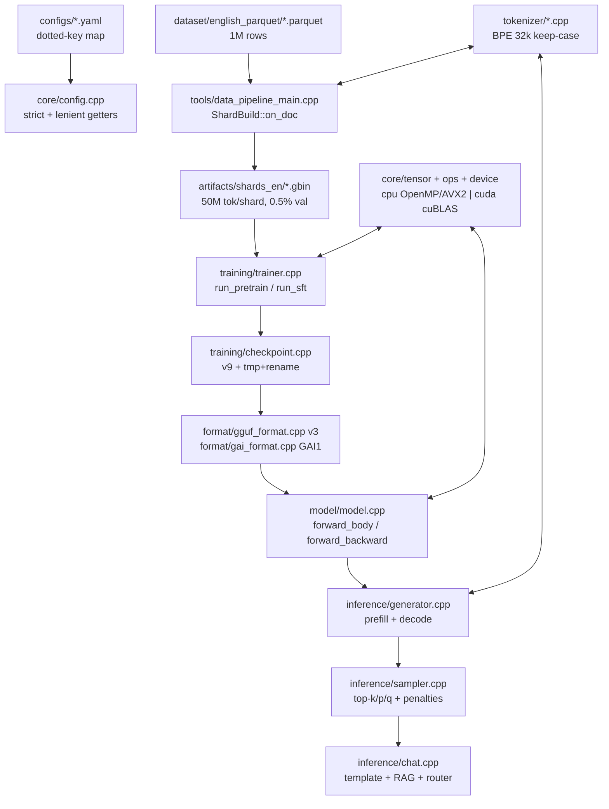

<div align="center">

# 🧠 Ghassan v1 Pro
### Sovereign English LLM Engine — from Parquet Lake to GGUF Chat in Pure C++ / CUDA

**480M MoE (204M active) • 1B MoE (336M active) • GQA • SwiGLU-MoE • QK-Norm • RoPE/YaRN • Lion/AdamW • NCCL-DDP • T4-Native**

[](CMakeLists.txt)
[](cuda/)
[](CMakeLists.txt)
[]()
[](dataset/english_parquet/manifest.json)

*Zero Python at runtime. CPU everywhere, CUDA when available. One repo builds tokenizer → shards → training → chat → GGUF.*

[🏗 Architecture](#-1-architecture--system-map) • [📁 File Tree](#-2-repository-map--شجرة-الملفات) • [🔬 Module Audit](#-3-module-by-module-audit-ملف-بملف) • [💾 Data](#-4-data--dataset-system) • [🚀 Quickstart](#-6-build--run) • [🩺 Senior Audit](#-10-senior-audit--hidden-bugs-that-compile-but-hurt-gpu)

</div>

---

## 📖 Table of Contents

- [0. What is this?](#-0-what-is-ghassan-v1-pro)
- [1. Architecture & System Map](#-1-architecture--system-map)
- [2. Repository Map / شجرة الملفات](#-2-repository-map--شجرة-الملفات)
- [3. Module-by-Module Audit (ملف بملف)](#-3-module-by-module-audit-ملف-بملف)
- [4. Data & Dataset System](#-4-data--dataset-system)
- [5. Techniques Matrix / التقنيات](#-5-techniques-matrix--التقنيات)
- [6. Build & Run](#-6-build--run)
- [7. Services / Binaries / CLI](#-7-services--binaries--cli--الخدمات)
- [8. Configs Matrix](#-8-configs-matrix)
- [9. Kaggle End-to-End Pipeline](#-9-kaggle-end-to-end-pipeline)
- [10. Senior Audit — Hidden Bugs That Compile but Hurt GPU](#-10-senior-audit--hidden-bugs-that-compile-but-hurt-gpu)
- [11. Strengthening Plan — How to Make the Model Stronger](#-11-strengthening-plan--how-to-make-the-model-stronger)
- [12. Evaluation](#-12-evaluation)
- [13. FAQ / Troubleshooting](#-13-faq--troubleshooting)

---

## 🌟 0. What is Ghassan v1 Pro?

**Ghassan v1 Pro** is a complete, dependency-light LLM stack written in **C++20 + CUDA**, trained on an **English Hermes lake (1,001,551 rows)** and designed for a **single Tesla T4 (16GB)** on Kaggle — with a 4×T4 DDP path for the 1B variant.

| Variant | File | Layers | Hidden / Heads / KV | Experts | Total / Active | Optimizer | Tokens/step | Memory |
|---|---|---|---|---|---|---|---|---|
| **Flash (legacy default)** | `model/model.h:16-27` | 26 | 768 / 12 / 4 | 8× top-2 + shared E=768 | **467M / 191M** | — | — | — |
| **en_pro (flagship fast)** | `configs/en_pro.yaml` | 26 | 768 / 12 / 4 | 8× top-2 + shared E=768, QK-Norm | **480M / 204M** | AdamW, B2×T1024×acc32=65536 | 65k | ~11.8GB |
| **pro_v1 (flagship strong)** | `configs/pro_v1.yaml` | 36 | 768 / 12 / 4 | 10× top-2 + shared E=1024, QK-Norm | **1.016B / 336M** | **Lion**, B1×T512×acc128=65536 | 65k | ~12.2GB |
| **t4_1b (4×T4 DDP)** | `configs/t4_1b.yaml` | 26 | 1024 / 16 / 4 | 8× E=1280 | **1.02B / 408M** | Lion, DDP | 65k/GPU | T4×4 |

> **Design philosophy (verified in code):** fp32 masters + fp16 GEMM compute (`gemm_fp16:true`, `loss_scale 16384`), RMSNorm everywhere, GQA (group=3–4), RoPE with NTK/YaRN hooks, SwiGLU-MoE DeepSeek-style (softmax → renormalized top-k + shared expert), z-loss `1e-4`, router jitter `0.01` (train-only), tie-embeddings, WSD schedule, activation checkpointing (en_pro), Lion for 1B memory (m-only ≈ 50% of AdamW).

**What you get in this repo (no Python at runtime):**

```
Parquet lake (21 files, 1M rows) → data_pipeline → .gbin shards
    → train_tokenizer → english32k.gtok → gai_train → .ckpt → .gguf/.gai
    → ghassan-ai chat/generate/bench/eval/logits
```

---

## 🏗 1. Architecture & System Map

### 1.1 High-level flow



### 1.2 Transformer block (one layer, exact order in `model/model.cpp:1028-1136`)

```
x ──► RMSNorm(attn_norm) ──► Wq/Wk/Wv ──► [QK-Norm?] ──► RoPE(θ_eff, YaRN) ──► GQA-Attention ──► Wo ──► +x (residual)
  ──► RMSNorm(ffn_norm) ──► MoE(top-2/8 + shared SwiGLU) or Dense(SwiGLU) ──► +x (residual)
  ──► ... ×26 (en_pro) / ×36 (pro_v1) ──► RMSNorm(final) ──► LM-Head (tied) ──► CE + z-loss
```

- **Attention:** GQA `H=12, KV=4` (group=3). `attention_forward_ex(probs=nullptr)` = memory-lean flash path, SWA `window` plumbed (`model.h:56-59`), decode via `attention_decode_ex` + `scores_[H*ctx]` scratch.
- **MoE:** flat contiguous `[ne*E,d] / [ne*d,E]` for cuBLAS + GGUF (`model.h:101-106`). Router `[ne,d]` GEMM → softmax → jitter (train) → top-k renormalize → grouped expert GEMMs + shared expert. Aux-loss `ne*mean(mean_prob*frac)` (`model.cpp:24-112`); aux-free bias variant (`moe_aux_free`, V3 §3.2).
- **Norms:** RMSNorm fwd `rsqrtf` + `isfinite→0` guard (`cuda/kernels.cu:379` mirrors `core/ops_cpu.cpp:339-343` f64 variance). Optional per-head QK-RMSNorm (`qk_qnorm/qk_knorm [hd]`).
- **RoPE:** interleaved default (`rope_type=0`), NeoX opt (`=1`), NTK `θ_eff = θ*scale^(hd/(hd-2))` (`model.cpp:327`), YaRN `mscale=0.1*ln(scale)+1` + ramp (`low=1, high=32`).

### 1.3 Compute dispatch

```
ops::{gemm,linear,embed,rmsnorm,rope,swiglu,moe,attention,CE,adamw/lion,...}  (core/ops.h:1-265)
        │  GAI_DISPATCH(dev)  (core/ops.cpp:16-25)
        ├─► cpu::*  OpenMP + AVX2 runtime dispatch, f64 norms, M==1 N-split, group-by-id embed
        └─► cuda_ops::*  default stream (sync), cuBLAS Sgemm/GemmEx FP16/BF16 (threshold 1M),
                         fused CE (1 D2H), tiled online-softmax attention, warp-route grouped MoE
```

- **Tensor:** dense contiguous row-major, `Storage` refcounted (`core/tensor.h:25-51`), 64B-aligned CPU, CUDA via `cudaMalloc`, mmap weights as read-only external views (`core/mmap.cpp`, `format/gai_format.cpp:306-333`).
- **Memory:** monotonic 64MB workspaces (`cuda/kernels.cu:45-53`, `cuda/moe.cu:43-52`); no per-step malloc in hot paths; `make_activations()` T² guard (>800MB fail, >400MB warn, `model.cpp:773-784`).

---

## 📁 2. Repository Map / شجرة الملفات

> Generated from disk 2026-09-23. `build_test/` = local build artifacts (not source). `dataset/english_parquet/*.parquet` = 21 binaries (~1.1GB).

```
Ghassan Ai model/
├── CMakeLists.txt                  # 229L: C++20, gai_core+gai_cuda, 5 bins, NCCL/Parquet autodetect, -Werror
├── .gitignore / .gitattributes     # ignores build/, artifacts/, *.gbin/gtok/parquet/ckpt/gguf
├── README.md                       # ← you are here
│
├── core/                           # foundation — 11 files
│   ├── common.h/cpp                # Error/fail/log/Timer/threads (97L)
│   ├── config.h/cpp                # minimal YAML dotted-map parser (342L)
│   ├── device.h/cpp                # Device abstraction, 64B alloc, OOM guard (175L)
│   ├── dtype.h/cpp                 # F32/F16/BF16/I32/I8/Q8_0/Q4_0/Q4_1/U16 + bit-twiddle
│   ├── mmap.h/cpp                  # RO whole-file mmap (Win+POSIX, 154L)
│   ├── tensor.h/cpp                # Tensor+Storage, view/to/clone (150L)
│   ├── rng.h                       # xoshiro256** + Box-Muller + fnv1a + splitmix (115L)
│   ├── unicode.h/cpp               # UTF-8 + Arabic/Latin classifier + folds (288L)
│   ├── ops.h / ops.cpp             # dispatch interface + GAI_DISPATCH (265L/460L)
│   ├── ops_cpu.h / ops_cpu.cpp     # CPU reference: OpenMP+AVX2, 987L
│   └── ops_moe.cpp                 # CPU MoE reference: top-k + shared + bwd (412L)
│
├── cuda/                           # GPU backend — 5 files
│   ├── cuda_ops.h                  # mirror of ops_cpu.h + workspace mgmt (157L)
│   ├── cuda_utils.h / .cu          # probe/pin/stream/cuBLAS handle/TF32 gate (161L)
│   ├── kernels.cu                  # GEMM/emb/norm/rope/swiglu/CE/sampling/optim (982L)
│   ├── attention.cu                # GQA tiled fwd + SWA + bwd + decode (521L)
│   └── moe.cu                      # warp-route + grouped GEMM + aux (896L)
│
├── model/
│   ├── model.h                     # ModelConfig + LayerParams + Activations (304L)
│   └── model.cpp                   # forward/backward, aux, validate, save/load (1481L)
│
├── inference/                      # 8 files
│   ├── kv_cache.h/cpp              # contiguous [L,max_len,kv_dim] F32, evict_front
│   ├── generator.h/cpp             # prefill/decode/chat/score, fast GPU top-k path (559L)
│   ├── sampler.h/cpp               # temp/top-k/p/min-p/rep/freq/pres/ngram/greedy (222L)
│   └── chat.h/cpp                  # template + RAG + script router + history trim
│
├── training/                       # 7 files
│   ├── trainer.h/cpp               # run contract, DDP, scaler, eval/save (1412L)
│   ├── optimizer.h/cpp             # AdamW + Lion + Muon/NS (611L)
│   ├── dataloader.h/cpp            # .gbin reader, stochastic windows, SFT masks (582L)
│   ├── checkpoint.h/cpp            # v9 container, atomic publish (756L)
│   ├── distributed.h/cpp           # NCCL file-rendezvous, fused buckets (254L)
│   └── scheduler.h                 # cosine + WSD, clamp (66L)
│
├── tokenizer/                      # 8 files
│   ├── tokenizer.h/cpp             # byte-BPE + .gtok + Stream (403L)
│   ├── bpe_trainer.h/cpp           # word-freq trainer, heap + linked-list (283L)
│   ├── normalizer.h/cpp            # codepoint pipeline, ZWNJ, lam-alef (140L)
│   └── chat_template.h/cpp         # <s> role <|end|> wire + masks + personas (109L)
│
├── dataset/                        # 20 src + lake
│   ├── cleaner.h/cpp               # PII/HTML/mojibake/quality/toxicity
│   ├── dedup.h/cpp                 # exact-hash + MinHash128/LSH16×8 + blocklist
│   ├── langid.h/cpp                # Darija/MSA/Fr/En lexicon + morphology
│   ├── english_logic.h/cpp         # EN dialog-act + discipline gates
│   ├── json_reader.h/cpp           # bounded messages_json DOM (parquet cells)
│   ├── parquet_reader.h/cpp        # Arrow row-group streaming
│   ├── retrieval.h/cpp             # BM25 + fuzzy lev + trigram rescue
│   ├── synth.h/cpp / synth_data.h/cpp  # compositional dialogue generator + pool
│   ├── corpus_stats.h/cpp          # measurement (fertility, coverage, lang share)
│   └── english_parquet/            # THE lake: 21×.parquet + manifest.json
│
├── quantization/
│   ├── quantize.h/cpp              # Q8_0/Q4_0/Q4_1 + F16/BF16, CPU-only, error metrics
├── format/
│   ├── gai_format.h/cpp            # native GAI1, 64B align, mmap F32 zero-copy
│   └── gguf_format.h/cpp           # GGUF v3 interop, 32B align, streaming write
├── evaluation/
│   └── benchmark.h/cpp             # 14-cat generative eval (40 EN + 35 Darija items)
│
├── tools/                          # 5 binaries
│   ├── cli_common.h/cpp            # --key value parser (silent-default, see audit)
│   ├── main.cpp                    # ghassan-ai: chat|generate|info|quantize|bench|tokenize|export|eval|devices|logits (770L)
│   ├── train_main.cpp              # gai_train: config→Model→Trainer→GGUF (275L)
│   ├── data_pipeline_main.cpp      # data_pipeline: parquet|build|synth|csvs|... (1703L)
│   ├── train_tokenizer_main.cpp    # train_tokenizer + --study (283L)
│   └── corpus_stats_main.cpp       # corpus_stats measurement CLI
│
├── configs/                        # 10 recipes
│   ├── en_pro.yaml / pro_v1.yaml   # flagships (see table §0)
│   ├── t4_1b.yaml                  # 4×T4 DDP 1B
│   ├── pro_auxfree.yaml            # aux-free research (bias not in .ckpt!)
│   ├── en_ollama.yaml              # llama.cpp compat (no shared/QK-Norm/SWA)
│   ├── sft_en_pro.yaml / sft_pro_v1.yaml / sft_en_4xt4.yaml
│   ├── synth_large.yaml / synth_billion.yaml
│   └── (kaggle/configs/pilot_moe.yaml = 200-step smoke)
│
├── kaggle/                         # cloud ops
│   ├── setup.sh                    # Release build, Arrow opt-in, tokenizer, lake verify
│   ├── build_english_data.sh       # lake → shards_en (chat + instruction domains)
│   ├── train_1b.sh                 # flagship 2-stage (preflight + pilot + PT + SFT + export + smoke)
│   ├── train.sh / train_full.sh    # older 1-stage / 2-stage variants
│   ├── train_4xt4.sh               # 4-rank NCCL spawn (untracked in HEAD, see audit)
│   ├── build_billion_data.sh / convert_*.sh  # retired (exit 1 unless LEGACY_DARIJA=1)
│   └── package.sh / package.ps1    # source zip (excludes artifacts/ — see audit R4)
│
├── tests/                          # ⚠️ ABSENT on disk (see §10 R0) — fossils in build_test/bin/test_*.exe only
└── build_test/                     # local CMake+Ninja artifacts (libgai_core.a + 7 exes, NOT source)
```

**Line-count signal (source only, excl. build_test + parquet binaries): ~155 C++ files ≈ 28k lines audited.**

---

## 🔬 3. Module-by-Module Audit (ملف بملف)

> Senior-level, line-accurate. Every claim verified against the tree 2026-09-23.

### 3.1 `core/` — foundation

| File | Purpose | Key symbols (file:line) | Notes |
|---|---|---|---|
| `common.h/cpp` | errors, logging, timing, threads | `Error:23`, `GAI_FAIL:30`, `Timer:50`, `num_threads:67` / `fail():17`, `strfmt():44`, `human_*:58` | Exceptions not codes; `cerr` for Warn+ |
| `config.h/cpp` | dependency-free YAML | `from_file:15`, `get_int:20`, `check_known:41` / parser `39-155` (tab reject `59`, `- ` lists `78`, quote-aware `91`) | 2-space indent, dotted keys, inline `[a,b]`; no anchors/tags/blocks |
| `device.h/cpp` | device + memory | `DeviceInfo:11`, `device_alloc:30` / probe `20`, cache `31-34` ⚠️, OOM guard `99-104` ⚠️ | 64B aligned CPU; `cudaMalloc` sync; H2D/D2H telemetry |
| `dtype.h/cpp` | dtypes + quant layouts | `Q8_BLOCK 64 / Q4_BLOCK 32:22`, `BlockQ8_0/Q4_0/Q4_1:26` + `fp32_to_fp16:53` (NaN→0x200 RNE) | `#pragma pack(1)` + static_assert; GPU uses `__float2half` |
| `mmap.h/cpp` | zero-copy weights | `MappedFile:23` (move-only, shared_ptr) / Win `69-96`, POSIX `98-115` | No madvise/prefetch/mlock |
| `tensor.h/cpp` | tensor | `Device:13`, `Storage:25`, `wrap_external:70`, `view:84`, `to:97` (shallow if same dev) | Row-major dense, no strides/sparse/autograd; `to()` sync 2× transient |
| `rng.h` | RNG | `Rng:9` xoshiro256**, `uniform:40` (24-bit), `below:46` (`% n` ⚠️), `normal:51` Box-Muller | Header-only, not thread-safe; `get/set_full_state` preserves spare |
| `unicode.h/cpp` | UTF-8 + Arabic | `decode:14` (+1+FFFD never stalls), `fold_arabic:237` (أإآٱ→ا,ى→ي,ة→ه), `stats:271` | No ICU; O(n) scans |
| `ops.h` | dispatch contract | GEMM precision `22-35` (`mnk_threshold 1M`), MoE `138-182`, attention `191-221` (SWA `window`, decode `scratch`), CE `229` (SUM grads + z), sampling `255` (K≤128) | Single-written model/trainer API |
| `ops.cpp` | dispatcher | `GAI_DISPATCH:16`, atomics `30` (fp16 true, bf16 false — T4), jitter clamp `40`, perf `89` | Thin forwards; CPU aux returns false/null/0 |
| `ops_cpu.h/cpp` | CPU kernels | AVX2 dispatch `27-118`, GEMM M==1 split `154-164`, embed group-by-id `316-326`, rmsnorm f64 `339`, rope cache `407`, attention tls `569-830`, CE double `833`, topk `938` | `schedule(static)`, cache-friendly orders |
| `ops_moe.cpp` | CPU MoE | jitter `16-40`, tls scratch `52-76`, `topk_pick:88`, fwd `105-187`, bwd serial `306` ⚠️ | DeepSeek softmax→top-k renormalized + shared |

### 3.2 `cuda/` — GPU backend

| File | Purpose | Key symbols | Notes |
|---|---|---|---|
| `cuda_ops.h` | GPU mirror | 1:1 of `ops_cpu.h` + `free_workspace`, `moe_aux_*` | Default stream, sync |
| `cuda_utils.h/cu` | resources | `CudaStream/Event/ScopedDevice:34`, `probe:33` (LOCAL_RANK pin `46`, max-mem pick, fp16 sm>5.3 / bf16 sm≥8), `malloc:92` (sync ⚠️), `cublas_handle:118` (TF32 only sm≥80 else DEFAULT, `GAI_TF32=0` opt-out) | No async/pinned anywhere ⚠️ |
| `kernels.cu` | dense/compute | `grid_for:26`, `workspace 64MB:40`, `gemm_fp16:95` (per-call convert ⚠️), `gemm:221` (row→col swap `256`, K≤0 fast `225`), `rmsnorm:363` (rsqrtf+isfinite `379`), `rope:445` (double phase, `pow` per token ⚠️), `CE:609` (fused, 1 D2H `689`), `topk:710` (64-block+exact K≤128), `adamw/lion:870` | Monotonic pools, never shrink ⚠️ |
| `attention.cu` | GQA | tiled fwd `38-133` (grid T,H,B, online softmax `98`), SWA `155-210` ⚠️ R1, bwd `235-335`, decode `359-432` (scratch `H*cur_len` ⚠️), `decode_ex:445` | T4 48KB guard `148` (hd=128 fails fast ✓) |
| `moe.cu` | grouped MoE | `moe_workspace 64MB:43`, grouped bufs +12%:59, `k_route:108` (warp/token), gather/scatter `256-348` (atomics ⚠️), `moe_build_groups:437` (D2H+H2D per layer ⚠️), fwd `492-644`, bwd `647-771` (~100MB+ ws), aux `778-881` (1 sync/microbatch ✓) | ~5 GEMMs/expert/layer → convert storm ⚠️ |

### 3.3 `model/` + `inference/` + `quantization/` + `format/`

| File | Purpose | Key points |
|---|---|---|
| `model/model.h:16-302` | config + params + activations | Flash defaults `V16k,d768,L26,H12/KV4,ctx4096`; Pro fields `use_qk_norm/z/rope_scale/yarn/SWA/rope_type` (defaults OFF = bit-identical legacy); `head_dim/kv_dim/q_dim:65`; `Parameter{w+g,decay,frozen}:81`; `LayerParams:92` (flat MoE contiguous); `Activations:136` (`moe_probs[N,ne]`, `logits[N|Cc,V]` chunked contract, `pos+pos_cached:164`, `attn_probs_tmp [B*H*T*T]` transient) |
| `model/model.cpp` | body | `moe_layer_aux:24` (CUDA folds to device `42`, CPU D2H `69`); `validate:192` (divisibility, hd%2, rope_scale[1,8], top_k≤8, shmem≤48KB `256`); `from_config:269` (i64→int checked); `Model():387` (alloc `[V,d],[qd,d],[kvd,d],[d,qd]`); `make_activations:697` (T² guard); `forward_body:938` (guards `942`, stale-device `930`, pos-cache `1013`, embed→norm→QKV→QK-norm→rope→attn(probs=null)→wo→norm→moe→residual→final); `forward_backward:1157` (chunked `Cc`, `moe_aux_begin/end` 1 sync, QK-norm exact bwd, attn recompute); `save/load_raw:1433` (GRAW exact match) |
| `inference/kv_cache.h/cpp` | cache | Per-layer `[max_len,kv_dim]` F32 contiguous; move-only; `set_length/advance` bounds; `evict_front(n,keep)` — CPU memmove / CUDA D2D via monotonic `tmp_` (freed in dtor). No paging/quant/shard |
| `inference/generator.h/cpp` | loop | `GenerationConfig:12` (stop_tokens=[END,EOS], stop_strings); `Generator:33` (`absolute_pos_ int64:94` monotonic RoPE across evictions ✓); ctor OOM guard `27-44` + scratch (`x/xb/q/k/v/proj/logits_dev/scores[H*ctx]`, `logits_host[V]`); `decode_step_logits:88` (M=1 GEMVs, `pos_dev` once/step `133`, D2D copy `139`, `attention_decode_ex` `147`); `forward_prefill:191` (batched P when fresh else sequential, probs=null flash-lean `229`, last-row-only head `289` O(V) not O(P*V), P>1024 chunked `329`); `prefill:303` (keep-tok0 truncate `318`); `generate:379` (fast iff `CUDA&&V≥512&&win≤2048&&ngram==0&&K≤128` `407` → ~1KB D2H vs 128KB; else host `sampler.sample` `434`; `evict_front(ctx/4,8)` `459`); `chat:488` (reset, encode, budget `max_ctx-max_new-4`, keep-BOS); `score_tokens:510` (512-block, `pos_offset`) |
| `inference/sampler.h/cpp` | sampling | Defaults `temp0.8,top_k40,top_p0.92,min_p0.05,rep1.12/win128` (`sampler.h:9`); `validate:35` clamps; `apply_penalties:74` (window copy→sort→run-length CTRL divide-pos/multiply-neg + freq*n+pres, `thread_local win_buf`); `ban_no_repeat_ngram:112` O(H*n); `sample:129` (penalties→ngram→greedy→scratch[V]→partial_sort/full sort→draw); order `rep→ngram→top-k→softmax→min-p→top-p→multinomial` |
| `quantization/quantize.h/cpp` | quant | `quantize/dequantize:12`, `Q8_0/Q4_0/Q4_1+F16/BF16:19`, `QuantError:32`; Q8 sym/64 `20-63` (NaN→zero-block), Q4_0 sym/32 `87-131` ([-8,7]+8 nibble, f16 scale), Q4_1 asym/32 `163-209` (scale+min); CPU-only ⚠️; tail zero-pad; `is_quantizable` block-multiple |
| `format/gai_format.h/cpp` | .gai | `GAI1:21`, layout header-kv+dir+vocab+64B tensors; `set_config:38` (persists every knob); `write:90` (.tmp+rename, `align64:31`); `open:166` (hb≤4MB,count≤1M,ndim≤8); `read_tensor_raw:285` (per-tensor open+seek+read ⚠️); `map_weights:306` (zero-copy wrap, holds MappedFile); `load:336` (full dequant+copy — inference always F32 ⚠️); `_mmap:360` (F32+shape-match wrapped else convert); `profile_for:407` (fp32/fp16/int8-Q8/int4-Q4+Q8emb); `export:432` (norm→F32, emb→profile) |
| `format/gguf_format.h/cpp` | GGUF v3 | `magic/version3:19`, `GGUFType/GGMLType:22`, dims innermost-first; setters `113-337` (arch/name/type/quant_version/size_label/file_type + tokenizer tokens/scores/types/merges/pre/chat_template/bos/eos + gtok ARRAY[U8] + normalizer); `tensor_to_ggml_bytes:370` (re-quant CPU, Q8-blk32-f16 ⚠️ mismatch vs internal blk64); `write:459` (streaming 1 tensor at a time, 32B pad, atomic rename); `open:605` (v2..3, counts≤100K, `data_start_=align(tellg,32)` O(1) ✓); `read_metadata/info:665` (string≤256MB,array≤1GB, gtok fast path); `model_config:882` (native `ghassan.*` else `llama.*` dense); `load_tokenizer:935` (blob bit-perfect else rebuild); `llama/moe_tensor_name:992,1060` (dual-name); `compat:1025` (refuse MoE/QK/YaRN/SWA/NeoX for llama ✓); `read_tensor_raw:1096` (O(1) seek, F32/F16/Q8/Q4_0 only, no mmap ⚠️); `load:1182` (dequant-all F32); `export:1257` (arch llama vs ghassan, router `[ne,d]→[d,ne]` transpose `1476`, `moe_bias` native-only) |

### 3.4 `training/`

| File | Purpose | Key points |
|---|---|---|
| `checkpoint.h/cpp` (74/756L) | v9 container | `TrainState:9` (step,tokens,best,seed,loader,sêche,scaler,sched-v8,ddp_world); `save×3:189,260,321` (AdamW/Lion/Muon, per-tensor D2H, tmp+rename); `load×3:384,495,604` (arch gate, kind-gated moments); `peek/latest_in:713,738` (`last.ckpt` else lex-max ⚠️); `arch_match:164` (shapes block, recipe warns); `CKPT_VERSION=9` (v8=sched, v9=Pro fields); no sharding/async; frozen elision; vocab gate `433`; corrupt guards `443,447` |
| `dataloader.h/cpp` (178/582L) | .gbin reader | `ShardWriter:76,98` (range+mask gates, u16/u32 auto); `Shard:134,176,226` (RAM vs streaming, per-thread fd); `open/open_glob/open_mix:316,346,351` (weighted mix normalized); `fill_from_shard:431` (one-doc-per-row isolation, best-of-4 longest-fit, PAD/-100 tails ⚠️ waste); `next:497` (∝size pick, 8× retry then FAIL never silent PAD ✓); `skip_batches:556` (full I/O replay ⚠️); `reseed/state:563-577` (v5 incl. Box-Muller spare ✓); SFT mask = next-token `487` ✓; no packing/prefetch ⚠️ |
| `distributed.h/cpp` (94/254L) | NCCL | `init:29` (rank-0 ID file unlink-first, 30s wait); `all_reduce/broadcast/barrier:138,155,172` (per-call sync; barrier=dummy all-reduce); `config_from_env:197` (SLURM→torchrun→default); `ScopedDistributed:238` RAII; no compression/ZeRO; full replica per rank |
| `optimizer.h/cpp` (148/611L) | optimizers | `AdamW:36` (fused 1-sync norm, clip, non-finite skip `t_--`, OpenMP, bias-corr); `Lion:485` (same, sign, m-only ~50% RAM ✓); `Muon:290,217` (Newton-Schulz 2 GEMMs/iter×ns_steps=5, serial shared scratch ⚠️); `save/load/state_bytes:110,136,383,436,538,561` (v1 + presence flags; disk recipe wins β/ε, live wins lr/clip/wd); frozen elision `25-33` (must freeze BEFORE ctor); decoupled WD gated `p->decay`; clip 0=off; no 8-bit/sharding/offload |
| `scheduler.h` (66L) | LR | `LrScheduler(peak,warmup,total,min_ratio,type,decay_frac)` — warmup from `peak/warmup` (never 0 `29`), cosine→`min_ratio*peak` or WSD (stable→linear last `decay_frac`); clamp `[0,total]`; WSD preferred for Kaggle resume |
| `trainer.h/cpp` (210/1412L) | run | `from_config:45` (steps XOR epochs else FAIL, `train_glob` override, `data.data_dir` conflict gate, strict typo catcher); ctor `290-718` (OOM/recipe guards, freeze-before-opt, precision fallback, pretrained gate, rank-salted seeds, arena, resume: peek→load→moments?`t_=N`:`t_=0`→DDP rebuild); `scaler_for_step:720` (iff fp16, clamp 16384); `forward_backward_micro:756` (full vs batch-split ckpt, ntok-weighted, frozen-emb re-zero); `run/run_pretrain/run_sft:922,1002,1134` (sched resolve, SUM accum, DDP SUM + global-ntok divide, all-masked no-op skip ✓, rank0 eval/save); `sync_*:1303,1360,1386` (fused staging, SUM no /world, exact fp32 ntok); `save:874` (rank0 + barrier, sched+world persisted); `evaluate:812` (z in, aux out ✓ parity) |

### 3.5 `tokenizer/` + `dataset/` + `evaluation/`

| File | Purpose | Key points |
|---|---|---|
| `normalizer.h/cpp` | normalize | Single-pass codepoints: control strip, ZWNJ-aware `53-59`, presentation unfold + lam-alef split `61-69`, tatweel/diacritic strip, Arabic→ASCII digits, fullwidth fold, optional fold_letters (OFF LM / ON LID-dedup), ASCII lower, ws-collapse newline-wins `78-89`, repeat collapse opt, trim; `canonical()` forces fold+lower+collapse(1); `pre_tokenize:133` glues leading space, splits Arab/Lat/Num/Punct/Space/Emoji/Other, Arabizi-aware (`3lach`, `kif7alk`) |
| `tokenizer.h/cpp` | BPE | Vocab = 16 specials + 256 bytes + merges; `build:37`, `bpe_chunk:112` (rank-greedy min-heap, fast path + 200k cache ⚠️ thrash/race), `encode:184` (normalize→pre-split→bpe), `Stream:252` (buffers incomplete UTF-8, FFFD on tail), `.gtok` = `GTOK`+ver+normalizer flags+vocab+ranked merges; `load` enforces `vocab[16+i]==byte(i)` `356`; `measure:381` fertility |
| `bpe_trainer.h/cpp` | trainer | Word-freq counts (`unordered_map`), linked-list words `62-69`, `pair_count+pair_words` index, max-heap stale-skip, deterministic tie-break; `max_token_bytes` in **codepoints** (`utf8_length:174` Arabic fairness ✓); re-normalize chunks `17-24` (no train/encode drift ✓); pad `<\|unusedN\|>` `267` |
| `chat_template.h/cpp` | wire | `<s> <\|system\|>…<\|end\|> <\|user\|>…<\|assistant\|>… </s>`; `encode:85` (BOS, role(0-mask)+body+`<\|end\|>`(assistant?1:0), trailing assistant opt); not Jinja — hardcoded C++; script route: Arabic-majority→Arabic persona else Latin; `en` bypasses |
| `cleaner.h/cpp` | cleaning | Hand PII (email/phone/URL-creds/IBAN/Luhn/API-keys/CIN/IPv4, no regex), `scan:210`, `redact:224`, `strip_html:263`, `mojibake:296`, `clean_line:321`, `quality:352`, EN profile `467,495` (`min_words=1,letter0.30,symbol0.35,digit0.50`, hard-disclosure-only, 1–4ch rescue), `toxicity:521` (20-term substring ⚠️ `rape⊂grape`) |
| `corpus_stats.h/cpp` | measure | Per-doc bytes/script/words/lines/LID/encode; aggregates avg/med/p10-p99, coverage, byte-fallback `16-271`, lang/script/arabizi/fr/emoji shares |
| `dedup.h/cpp` | dedup | Exact `hash(canonical)` + MinHash128/5-word + LSH16×8 thr0.85 (synth 0.80); band tables store ALL ids (`vector<unordered_map<u64,vector<u32>>>` ✓ fix); verify by ratio; RAM blow 1M docs ≈1GiB+ ⚠️ |
| `langid.h/cpp` | LID | Folded + word_split, script densities; Darija-Ar ~100, Darija-Lat ~90, MSA ~60 (في/من/على ⚠️ collide), Fr ~60, En ~220; morphology كي/كا/تا/غا/ما…ش, arabizi digit-in-word; Arabic→Darija if `dar≥0.06‖≥2` else MSA; Latin 3-way guarded tie-keeps-Darija + `en≥2` rescue; Mixed; style `319` (boilerplate, bullets, MSA-leak `>0.14`, short-Q/long-A caps); EN mode hard-only |
| `json_reader.h/cpp` | JSON | **Parquet-only**: single-object `messages_json` parser; bounded DOM (depth32,members10k,array10M,file2GiB), `\u`+surrogates; schema `messages/conversation/turns`→chat (cap128), `instruction+input/output`→chat, else text_keys; malformed→false skip never throw; file ingestion deleted on purpose |
| `parquet_reader.h/cpp` | parquet | Sorted recursive discovery `24`; row-group streaming (1 resident), dict→UTF-8, STRING/BINARY/LARGE_*, 1MiB trunc ⚠️, missing→`""` ⚠️; no-Arrow → loud FAIL, `rows=-1` |
| `retrieval.h/cpp` | BM25 | Normalize (lower, collapse, strip D9 8B-92, conditional Arabizi `3→a,7→h,9→q` preserves `3+4` ✓); dedup normalized-Q; BM25 k1=1.2 b=0.75 `idf=log((N+1)/(df+1))+1`, inverted `std::map` ⚠️ log-N; query qtf boost, fuzzy lev≤1/2 (≤15ch) 0.75, trigram-Dice ≥0.25 rescue (rebuilds per query ⚠️), bigram+0.5, substring+5.0; flat JSON reader 2GiB cap |
| `english_logic.h/cpp` | EN contract | Order greeting→coding→instruction→question→reasoning→chitchat `121`; connectors; discipline: non-empty, no `as an ai…`, MC `a.-d.×2`→`^[a-d][.:) ]` `170`, coding→code tokens |
| `synth.h/cpp` + `synth_data.h/cpp` | synth gen | Scenario graph × realizer × planner; script `0.62/0.28/0.10` (billion `0.55/0.30/0.15`), heavy_digits0.7, greeting0.30, turns2–12/14, correction/misunder/ governor/reasoning/identity/followup/backchannel0.18, closer0.35, FR inject0.12–0.15, filler0.22; transliteration whole-word+longest-match+alt0.30+noise (ch→sh0.25,7→h0.12); filters template-cap, MinHash0.80, robotic, first-2-words>6% after 200; JSONL io; pool 19 domains, governor/refusal/grounding, reasoning math chains, ~40 greetings, 8 systems; script-mixing fallback accepts leak ⚠️ `synth.cpp:366-391` |
| `evaluation/benchmark.h/cpp` | eval | 14-cat generative; `builtin_suite:132` (~35 Darija), `builtin_suite_en:351` (40 Hermes, `expect_lang=en`); `load_suite:684` (dir scan + `en`-in-path heuristic ⚠️ + builtin fallback); `evaluate_item:796` (chat, timing, fuzzy/forbid case-insens, `is_robotic:109`, `distinct_n:57`, `max_ngram_repeat:80`, LID gate, toxicity, EN discipline); score `0.5match+0.2no-forbid+0.1len+0.1non-robotic+0.1non-toxic` `882` (excludes lang/discipline/distinct ⚠️); `run:893` (filter, max_prompts trunc); **no perplexity; `tokens_per_sec` never computed** ⚠️ |

### 3.6 `tools/` + `configs/` + `kaggle/`

See [§7](#-7-services--binaries--cli--الخدمات) and [§8–9](#-8-configs-matrix). Key: `cli_common` silent-default (`num/real` warn+default `cli_common.cpp:75-112` ⚠️), `data_pipeline` 10 subcommands (`parquet` THE path, `build` legacy duplicate ⚠️ drift), `ghassan-ai` 10 commands, `gai_train` overrides + `LOCAL_RANK` pin + dry-run, `train_tokenizer` full-RAM ⚠️.

---

## 💾 4. Data & Dataset System

### 4.1 The lake — `dataset/english_parquet/manifest.json`

```json
{ "created_utc": "2026-09-21T19:13:06Z", "input": "openhermes2_5.json",
  "total_objects": 1001551, "chat_rows": 522715, "instruction_rows": 478836 }
```

| Split | Files | Rows | Columns |
|---|---|---|---|
| `english_chat_part000..010.parquet` | 11 | 522,715 | `messages_json,user,assistant,system,category,source` |
| `english_instruction_part000..009.parquet` | 10 | 478,836 | same |
| **Total** | **21** | **1,001,551** | zstd + dictionary, UTF-8 only |

> Scale envelope (Hermes-style, verify via `inspect`): chat ~300–600 tok/conv, instruction ~150–350 tok/pair ⇒ **~250–450M tokens raw**, less after quality/toxic/PII/robotic/dedup drops. Planned synth `700k×~380≈266M + SFT 150k×380≈57M` ⇒ **0.5–0.7B combined** (`synth_billion.yaml:7-12`, name aspirational).

### 4.2 Pipeline — `tools/data_pipeline_main.cpp` (`ShardBuild:187`, `cmd_parquet:505`, `cmd_build:1294`)

```text
lake/*.parquet ─list_parquet_files (sorted, --match)─► read_parquet_docs (row-group streaming, dict→utf8, 1MiB cap)
  │ --mode routing (559-639)
  ├─ qa:   question+answer → chat[U,A]
  ├─ chat: messages_json ─doc_from_json_text─► chat[N-turn]  else user+assistant(+system) → chat
  │        └─ refuse loudly if schema absent (667-676) ✓
  ├─ text: cells joined "a / b" (skip _*,uuid) → text
  └─ auto: QA→chat, messages→chat, rest→text
  ▼
ShardBuild::on_doc (344-441) per doc:
  clean_line → quality[_english] → dialog-act (EN) → toxicity → PII redact(EN)/drop(Darija)
  → style gate (darija:check_assistant_style / en:hard-boilerplate+MC)
  → dedup.add(canonical) → lid.classify → ChatTemplate::encode (assistant-only mask) / tok.encode
  → emit_windowed: split >seq_cap into NON-OVERLAP windows, train/val by hash(canonical) — all windows one side ✓
  ▼
ShardWriter → train[_<domain>]_*.gbin / val[_<domain>]_*.gbin (50M tok/shard, val 0.5%) + report + min-keep gate
```

Invariants (both routes): `--expect-vocab` gate (`222,1301`), canonical-hash split (`289,1370`), window-split not truncate (`324,1402`), `min-keep` gate (`485,1596`).

### 4.3 Tokenizer data

- `parquet-corpus` → flat `corpus_en.txt` for BPE; `train_tokenizer --keep-case --vocab 32000` (+ `--study` trains 16k/24k/32k + fertility + `vocab*768` embedding cost + smallest-within-3% rule `224-231`).
- Legacy `build` route mirrors chain for `--text/--json/--chat/--synth`; side routes `csvs/csv2json/jsons/synth/tok-info/inspect/retrieve`; `json/dump-text` removed stubs.

---

## 🧪 5. Techniques Matrix / التقنيات

| Technique | Status | Where |
|---|---|---|
| Decoder-only pre-norm Transformer | ✅ | `model.cpp:1028` |
| GQA (H12/KV4, group 3) | ✅ | `model.h:20`, `model.cpp:1078`, `generator.cpp:147` |
| MQA (KV=1) | ❌ | — |
| SWA sliding window | ⚠️ field plumbed, kernel TODO | `model.h:56`, `model.cpp:1080`, `generator.cpp:149` |
| RoPE interleaved + NTK + YaRN ramp | ✅ | `model.h:60`, `model.cpp:323-348,1067` |
| RoPE cache | ❌ recomputed per layer/step ⚠️ | `model.cpp:1064`, `generator.cpp:130` |
| RMSNorm (+ per-head QK-Norm) | ✅ | `model.cpp:1038,1058`, `generator.cpp:114` |
| SwiGLU dense / SwiGLU-MoE top-2/8+shared | ✅ DeepSeek-style | `model.h:29-41,101-113` |
| Aux-loss + aux-free bias + jitter 0.01 | ✅ | `model.cpp:24-112`, `moe_aux_loss:1385` |
| KV-cache contiguous F32, `evict_front(keep)` | ✅ non-paged, no quant | `kv_cache.cpp:14,26` |
| Sampling temp/top-k/top-p/min-p/rep/freq/pres/ngram/greedy + GPU fast path | ✅ | `sampler.cpp:129`, `generator.cpp:401` |
| Chat template + personas + RAG/BM25 + router | ✅ hardcoded C++, not Jinja | `chat.cpp`, `retrieval.cpp` |
| BPE 32k keep-case + Stream + .gtok | ✅ | `tokenizer/` |
| MinHash128/LSH16×8 + exact + blocklist | ✅ | `dedup.h:55` |
| BM25 k1=1.2/b=0.75 + fuzzy + trigram rescue | ✅ | `retrieval.cpp:429,490` |
| AdamW / Lion (m-only) / Muon (NS) + clip + WSD/cosine | ✅ | `optimizer.cpp`, `scheduler.h` |
| Grad accum SUM + 1 global divide (ntok-weighted) | ✅ P0-05 correct | `trainer.cpp:1044` |
| Mixed precision fp32 masters + fp16 GEMM + dynamic scaler | ✅ T4-appropriate (no BF16 cores) | `trainer.cpp:404,720` |
| DDP NCCL SUM + rank-salted seeds + fused buckets | ✅ | `trainer.cpp:1303`, `distributed.cpp` |
| Checkpoint v9 + tmp+rename + sched/loader/RNG/scaler | ✅ (Lion/Muon v9 bug ⚠️ §10) | `checkpoint.cpp` |
| Activation checkpointing (batch-split) + chunked CE | ✅ | `trainer.cpp:756`, `model.cpp:1194` |
| Quant Q8_0/Q4_0/Q4_1 + GAI1/GGUFv3 | ✅ storage-only ⚠️ (inference F32) | `quantize.cpp`, `format/` |
| 8-bit optim / ZeRO / packing / prefetch / async-save / ppl harness | ❌ | roadmap §11 |

---

## 🔨 6. Build & Run

### 6.1 Requirements

- CMake ≥3.20, C++20 compiler (MSVC / GCC / Clang), Ninja or Make
- Optional: CUDA Toolkit (default arch **sm_75 T4** — override `-DCMAKE_CUDA_ARCHITECTURES=86/89/80/120`), NCCL (4×T4), Apache Arrow (parquet lake), libcurl (gemini-chat, else Python fallback), OpenMP
- Reference: T4 16GB / 13GB RAM / 19.5GB disk; session 360–540 min + 900s export margin (`kaggle/configs/pilot_moe.yaml`)

### 6.2 Configure flags (`CMakeLists.txt:27-32,51-86`)

| Flag | Default | Meaning |
|---|---|---|
| `GAI_ENABLE_CUDA` | ON | build CUDA backend if toolkit found; else CPU-only (runs anywhere) |
| `GAI_ENABLE_OPENMP` | ON | OpenMP CPU kernels; else single-threaded |
| `GAI_BUILD_TESTS` | ON | `tests/test_*.cpp` glob + ctest |
| `GAI_NATIVE_ARCH` | OFF | `-march=native` (C++ only, never nvcc — `35-37`) |
| `GAI_ENABLE_NCCL` | ON | multi-GPU (manual header+lib detect, no CMake module) |
| `GAI_ENABLE_PARQUET` | OFF | **MUST be ON on Kaggle** (`setup.sh --with-parquet`) — THE lake input; no JSON fallback |
| `CMAKE_CUDA_ARCHITECTURES` | 75 | one arch = fast nvcc; `setup.sh` auto-detects (86/89/80/120 need CUDA ≥12.8 for 120) |

> Zero-warning policy: `/WX` (MSVC) / `-Werror` (GCC/Clang). `-ffast-math` deliberately removed — breaks `isfinite` for loss scaling (`CMakeLists.txt:47-48`).

### 6.3 Build

```bash
# CPU-only (anywhere)
cmake -S . -B build -DCMAKE_BUILD_TYPE=Release
cmake --build build -j

# CUDA T4 (Kaggle — prefer kaggle/setup.sh, it wraps this + Arrow + tokenizer)
cmake -S . -B build -DCMAKE_BUILD_TYPE=Release -DGAI_ENABLE_PARQUET=ON
cmake --build build -j2   # JOBS≤2 + ccache on Kaggle

# Other GPUs
cmake -S . -B build -DCMAKE_CUDA_ARCHITECTURES=86   # 3090 / 4090=89 / A100=80 / 5060=120
```

Outputs → `build/bin/`: `ghassan-ai`, `gai_train`, `train_tokenizer`, `corpus_stats`, `data_pipeline` (+ `test_*`, optional `gemini-chat`).

---

## 🛠 7. Services / Binaries / CLI / الخدمات

| Binary | Commands | Required | Example |
|---|---|---|---|
| `ghassan-ai` (`tools/main.cpp:744`) | `chat‖generate‖info‖quantize‖bench‖tokenize‖export‖eval‖devices‖logits` | `--model`, `--prompt` | `ghassan-ai chat --model artifacts/ghassan-v1-pro_q4_0.gguf --persona en` |
| `gai_train` (`tools/train_main.cpp`) | `--config` (defaults `configs/en_pro.yaml`!) + overrides `--batch-size/--seq-len/--grad-accum/--max-steps/--lr/--warmup/--seed/--optimizer/--scheduler/--ckpt-segments/--ce-chunks/--strict-config/--allow-recipe-drift/--gemm-fp16/--device/--export` | `--config` | `gai_train --config configs/pro_v1.yaml --dry-run` → estimate; without → `Trainer::run()` → optional GGUF export |
| `train_tokenizer` | `--input <file‖dir .txt/.jsonl/.text> --output --vocab [32000] --min-freq [2] --synth --study --eval --keep-diacritics/--fold-letters/--keep-case` | corpus | `train_tokenizer --input corpus_en.txt --output artifacts/tokenizer/english32k.gtok --vocab 32000 --keep-case` |
| `corpus_stats` | `--input <file‖dir> --tokenizer --dedup --pii --quality --limit --sample` | `--input` | `corpus_stats --input lake/ --tokenizer english32k.gtok --dedup` |
| `data_pipeline` | `parquet` (THE path) `parquet-corpus` `tok-info` `csvs` `csv2json` `jsons` `synth` `build` (legacy) `retrieve` `inspect` | `--tokenizer` (shard routes) | `data_pipeline parquet --lake <lake> --match english_chat --mode chat --tokenizer english32k.gtok --expect-vocab 32000 --style-mode en --keep-case --seq-len 1024 --domain english_chat --out artifacts/shards_en` |

Global: `--device auto|cpu|cuda` (metal/vulkan/tpu → CPU warn, `main.cpp:98`), `--threads/--quiet/--verbose` (last wins), `--ctx N≤max_seq_len`, generation `--temp/--top-k/--top-p/--min-p/--repeat/--no-repeat-ngram/--max-tokens/--seed/--greedy/--no-fast-sample/--system/--persona/--ctx/--retrieve-*` (`main.cpp:38,237`).

---

## ⚙️ 8. Configs Matrix

| File | Arch / Train | Notes |
|---|---|---|
| `en_pro.yaml` | 480M/204M, 768×26L×12H/4KV, 8exp top-2 + shared E=768, QK-Norm, ctx4096; B2×T1024×acc32=65k, AdamW, act-ckpt seg2, ~11.8GB | flagship fast |
| `pro_v1.yaml` | 1.016B/336M, 768×36L, 10exp top-2 + shared E=1024; B1×T512×acc128=65k, **Lion mandatory**, act-ckpt off, 12.2GB | flagship strong |
| `t4_1b.yaml` | 1.02B/408M, 1024×26L×16H/4KV, 8exp E=1280, `ddp:true`, Lion, B1×T512×acc128/GPU | 4×T4, math proof in header `5-12` |
| `pro_auxfree.yaml` | en_pro shape, `moe_aux_scale 0.0 + moe_aux_free true`, Lion | research; **EMA bias NOT in `.ckpt`** — GGUF only |
| `en_ollama.yaml` | `moe_shared false, use_qk_norm false, rope_scale 1.0, SWA 0, rope_type 0` | `llama_moe` mapping; cannot resume en_pro |
| `sft_en_pro.yaml` | en_pro arch, `lr 1.2e-4`, acc16, AdamW, mix 0.65/0.35 | SFT-1 |
| `sft_pro_v1.yaml` | pro_v1 arch, Lion, B1×T512×acc64 | SFT-1B |
| `sft_en_4xt4.yaml` | 480M arch, B2×T1024×acc16×4GPU=131k, Lion, `ddp:true` | 4-GPU SFT |
| `synth_large/billion.yaml` | data-gen only (200k / 700k+150k convs, template caps anti-collapse) | Darija heritage (unused by EN lake) |
| `kaggle/configs/pilot_moe.yaml` | 480M smoke, B1×T256×acc2=512 tok/step ×200 steps ≈102k tokens | 20–100-step tok/s pilot |

Shared: `vocab 32000 keep-case`, `rope_theta 10000`, `rms_eps 1e-5`, `tie_embeddings true`, `z_loss 1e-4`, `jitter 0.01`, `gemm_fp16 true + loss_scale 16384`, `seed 42`, mix `chat 0.80 / instruction 0.20` (SFT 0.65/0.35), WSD (`sched_decay_frac 0.2`).

---

## ☁️ 9. Kaggle End-to-End Pipeline

```text
setup.sh [--with-parquet]  →  Release build (JOBS≤2, ccache, arch auto) + tokenizer train + lake verify
        │  Arrow opt-in (FATAL if requested+missing), parity gate
        ▼
build_english_data.sh  →  lake/*.parquet ──mode chat──▶ shards_en/train_english_{chat,instruction}_*.gbin
  (EN_PARQUET_DIR or /kaggle/input)  --style-mode en --keep-case --seq-len 1024, mix check, exit 1 on MISSING
        ▼
train_1b.sh (flagship) / train_full.sh / train.sh
  preflight (vocab, mix-vs-shards, inspect, CPU dry-run) → pilot 20–100 steps (tok/s, --resume none)
  → budget→steps (warmup 10% capped) → stage-A PT → stage-B SFT
  → --export GGUF self-contained → smoke generate --persona en (FATAL on fail)
  → trap persist → /kaggle/working/output  (train_full.sh HAS NO trap! ⚠️)
        ▼
package.sh / package.ps1  →  zip source (excludes artifacts/ → tokenizer NOT shipped! ⚠️)
```

| Script | Role / hardening |
|---|---|
| `setup.sh` | `SKIP_TESTS=1` default; unknown flags silently dropped ⚠️; Arrow FATAL if requested; tokenizer auto-train lake→corpus (`PARQUET_CORPUS_LIMIT` 400k) → `--keep-case --vocab 32000`, corpus deleted after; vocab gate via `tok-info‖grep`; sharding deferred |
| `build_english_data.sh` | needs `--with-parquet` build; two `--domain` invocations; mix gate `exit 1`; **does not search `dataset/english_parquet/`** though lake vendored there ⚠️; no disk guard |
| `train_1b.sh` ⭐ | preflight P1–P6 (mix-vs-shards Python check), disk guard 10GB, pilot `--resume none` (stale-ckpt tok/s fix ✓), warmup 10% capped, `EVAL_CAD`, persist trap `74-83` |
| `train.sh` / `train_full.sh` | older clones; `train_full` lacks trap+disk guard+preflight ⚠️; `train.sh:50-52` clobbers `--pro`+`--export-profile` combo (suffix frozen fp16) ⚠️; triplicated `yget()`+pilot math |
| `train_4xt4.sh` | 4 ranks (`LOCAL_RANK/RANK`), NCCL env, stale-ID cleanup, GPU-count gate, orphan-kill trap; **untracked in HEAD** (root copy identical); `WORLD_SIZE` override ignored by hardcoded `for i in 0 1 2 3` ⚠️ |
| `pilot_moe.yaml` | smoke recipe (see §8) |
| `build_billion_data.sh` / `convert_final.sh` / `convert_data.sh` | retired — `exit 1` unless `LEGACY_DARIJA=1` (JSON route dead; CSV branch alive) |

---

## 🩺 10. Senior Audit — Hidden Bugs That Compile but Hurt GPU

> These pass `-Werror` and run — but silently cost VRAM, tok/s, or quality. Ranked by blast radius. Each item cites the exact line and the fix.

### 🔴 P0 — Fix now (correctness / session-loss)

**[P0-1] Lion/Muon resume silently drops optimizer moments on v9 checkpoints — flagship 1B affected.**
`training/checkpoint.cpp:508` (Lion), `:617` (Muon): `is_legacy = (version != 8 && != 7 && != 6 && != 5)` → v9 = **true** → legacy path (`582-589, 691-698`) returns after weights without consuming `has_opt/kind/moments`. Every current checkpoint resumed under Lion/Muon cold-starts moments (`moments_restored=false → t_=0`, `trainer.cpp:666-672`). Hits `pro_v1.yaml`, `sft_en_4xt4.yaml`, `t4_1b.yaml` (all Lion). AdamW path correct (only `version==3` special, `:472`).
**Fix:** `is_legacy = (version < 5u)`; update stale `// Accept v3..v8` comments (`:503,614`) to v9. One-line change, restores exact multi-session resume.

**[P0-2] SWA forward denominator 32× overcount → silent 1/32 outputs.**
`cuda/attention.cu:187-201`: second loop over `j=j0..t` replicated on all 32 lanes (full `sum` each), then `__shfl_xor` reduction multiplies by 32. Max path (`177-186`) correctly strided; sum path not. Non-SWA tiled path correct.
**Fix:** stride second loop (`for(j=j0+lane; j<=t; j+=WARP)`) or remove shfl and broadcast lane-0 sum. Validate with SWA-vs-full parity test before enabling `sliding_window>0`.

**[P0-3] `tests/` deleted — safety net fictional.**
`tests/test_configs.cpp` + `test_regressions.cpp` absent on disk and in git (`git log --all -- "*test*"` finds one mention only); fossils remain (`build_test/bin/test_*.exe`, `CTestTestfile.cmake`, `LastTest.log`). `GAI_BUILD_TESTS=ON` + `ctest` passes trivially on stale binaries.
**Fix:** restore from build machine, commit, add `TIMEOUT`, seed fixtures (not `artifacts/`); add at minimum: vocab-gate, canonical-split no-leak, window-mask alignment, parquet-probe tests. CMake comment references `test_gradcheck.cpp` (`CMakeLists.txt:213`) — file absent, add it.

### 🟠 P1 — GPU starvation / VRAM (biggest tok/s levers)

**[P1-1] Synchronous dataloader on training thread — GPU idles on disk.**
`training/dataloader.cpp:497-554` (`next`) + `249-280` (streaming `read_window`): 2 seeks + 2 small reads **per row per micro**, `out.ids/targets` re-`assign`ed per micro (`504-505`), linear shard scan per row (`537-543`), best-of-4 RNG attempts (`448-464`). `pro_v1` = 128 micros × 1 row = 128+ reads + 128 H2D copies/step, all GPU-idle. `en_pro` B2/acc32 = 64 rows × ≤4 attempts.
**Fix:** double-buffered prefetch worker (produce micro *t+1* while GPU runs *t*); coalesce same-shard rows into one range read; reuse buffers.

**[P1-2] FP16 fast path pays full convert-per-GEMM traffic, no weight cache.**
`cuda/kernels.cu:118-145,238-244`: converts A+B (2 launches + fp32 read / fp16 write) for **every** large GEMM; MoE ≈5 GEMMs/expert/layer → ~360 conversions/step at 36L. Threshold `ops.cpp:81` (1M) routes almost all training GEMMs here.
**Fix:** persistent fp16 weight cache (convert once/step, reuse across `grad_accum` micros); profile `k_f32_to_f16_strided` vs `GemmEx` with Nsight before tuning threshold.

**[P1-3] Fully synchronous default-stream + per-layer D2H/H2D syncs.**
`cuda/cuda_utils.cu:106-112` (`cudaMemcpy`), `cuda/moe.cu:475-476,485-486` (ne-int D2H+H2D per MoE layer in `moe_build_groups`), `kernels.cu:689,949,975` (CE/norm syncs), penalties H2D `745`. No `MemcpyAsync`, streams, or pinned memory; `device_copy` telemetry confirms.
**Fix:** device-side grouping (prefix-sum in shared/cub), pinned hist + async, extend per-microbatch aux pattern (`moe_aux_begin/end:819-830`) to grouping.

**[P1-4] MoE gather/scatter serial over d/E + `atomicAdd` storm.**
`cuda/moe.cu:257-285`: one thread/slot loops `for(j<rowlen)` (768–1280 serial uncoalesced); `k_scatter_add:298` `atomicAdd(&o[j],…)` = `N*K*d` atomics (≈3M/step/layer); `k_dp_dot:337-348` same.
**Fix:** element-parallel kernels (1 thread/4 floats, `float4`), replace K=2 scatter contention with register reduce + single write.

**[P1-5] Quantization is disk-only; inference always F32.**
`format/gai_format.cpp:389-397` + `gguf_format.cpp:1195,1203` dequant-all to F32 at load; `quantize.cpp:247,271` CPU-only; decode uses F32 GEMM (`generator.cpp:116-118,151,166-169,177`). 467M F32 ≈1.8GB + KV ~200MB + logits — `int4 ~130MB` is file size only.
**Fix:** add Q8_0/Q4_0 GEMM (at least dequant-on-the-fly) or F16 inference path; document `profile=int4` as storage-only; add `--dtype f16` fast path.

**[P1-6] Checkpoint save = full synchronous multi-GB stall on training thread.**
`trainer.cpp:874-918` → `checkpoint.cpp:189-257`: per-tensor `to(CPU)` + weights+moments write, every `save_every=500` (+ coinciding `best.ckpt` inside eval `1113-1116` vs `1122-1124` → occasional double ~8–12GB write), plus unconditional final `save("last.ckpt")` even if just saved (`1127,1241`).
**Fix:** skip final save if `step % save_every == 0`; stagger best/last; long-term background writer (stage `.tmp` off-thread, atomic rename on-thread).

**[P1-7] Silent numeric defaults burn GPU hours.**
`tools/cli_common.cpp:75-112` (`num/real/num_int/num_u64` warn-and-continue); inherited by `gai_train` overrides (`train_main.cpp:78-121`); pilot math plans from truncated ints.
**Fix:** `--strict-args` (fail on malformed) or echo resolved overrides in `[cfg]` log + fail pilot if `P_TPS==0`.

### 🟡 P2 — Memory / quality / UX (should-fix)

| # | Issue | Location | Fix |
|---|---|---|---|
| P2-1 | CUDA OOM guard uses **stale startup** `free_mem` | `core/device.cpp:31-34` cache + `99-104` guard | `cudaMemGetInfo` per alloc (or MB-threshold) or drop guard, rely on `CUDA_CHECK` |
| P2-2 | Monotonic workspaces never shrink + fragile aliasing | `kernels.cu:45-53`, `moe.cu:43-52` (growth does `Free+Malloc` mid-GEMM `49-50`, MoE bwd ~100MB+ `665-687`) | cap + `MallocAsync`/pool, split GEMM-convert vs reduction scratch, pre-size first batch |
| P2-3 | Prefill grid `(T,H,B)×32` = low occupancy | `attention.cu:143-150` (e.g. 24k 1-warp blocks, serial K/V tiles `67-122`) | 128–256-thread blocks, persistent-tile scheduler, autotune `KV_TILE` per `hd` |
| P2-4 | Decode uncoalesced + unchecked `cur_len` + global scratch | `attention.cu:359-421,445-518` (`scratch[H*cur_len]` `368`, serial stride-`KV*hd` `416-420`, `(void)max_len` `426/510` → OOB risk) | `GAI_CHECK(cur_len<=max_len)`, tile V in shared, `float4`, KV blocking |
| P2-5 | `rmsnorm_bwd_dw` serial over rows, uncoalesced + f32 vs CPU f64 drift | `kernels.cu:403-410` (768 threads, stride-`dim`, 1.5M strided loads) vs `ops_cpu.cpp:339-343` f64 | row-parallel block reduction, accumulate `double` then cast |
| P2-6 | No RoPE cache; `pow/sincos` per layer/step | `model.cpp:327,1064`, `generator.cpp:130,135,255`; GPU `pow` per (token,half) `kernels.cu:458,507` vs CPU host table `ops_cpu.cpp:407-426` | hoist `theta_eff`, precompute `inv_freq[hd/2]` + per-pos cos/sin cache to `max_context` |
| P2-7 | Legacy sampler O(V log V) + O(V) fill/token on CPU | `sampler.cpp:143-154` (fill `scratch_[V]`, full `sort` when K==0/≥V, else `partial_sort`); fast path only `CUDA&&K≤128&&win≤2048&&ngram==0` (`generator.cpp:407`) | CPU `nth_element+sort K`, greedy bypass, K=128 cap before min-p/top-p |
| P2-8 | No fused QKV / Flash-decode; M=1 GEMMs memory-bound | `generator.cpp:116-118,151,147` (3–4 M=1 GEMVs/layer + full `slot+1` KV scan) | fuse wq/wk/wv, F16 KV+compute, FlashDecode tiling, GQA-on-the-fly verify |
| P2-9 | KV eviction stop-the-world serial copy | `generator.cpp:199,334,364,459` `evict_front(ctx/4,8)`; `kv_cache.cpp:34-57` L×memmove / L×2 D2D, no overlap (≈27MB / 54 copies/event at L26) | ring-buffer KV (`pos % max_len` + absolute RoPE, already have `absolute_pos_`) → O(1); or double-buffer+async |
| P2-10 | GGUF no mmap; GAI mmap F32-only + per-tensor opens | GGUF `1123-1131` open+seek+read/tensor + F32 heap `1138`; GAI `285-298` same; `311` rejects padded mappings | GGUF mmap+wrap mirror of GAI; single fd/`MappedFile`; relax `>=`; `madvise WILLNEED`; streaming dequant |
| P2-11 | GGUF Q8 block mismatch + K-quant aliasing | internal Q8 blk64/f32 (`quantize.cpp:20-42`) vs GGUF blk32/f16 (`gguf_format.cpp:349,391`); `q4_k_m/q6_k→Q4_0/Q8_0` warn-only (`1231-1250`); true Q4_K rejected (`1169`) | fail-or-rename honestly (`q4_0` not `q4_k_m`) or implement K-quant; add `logits` parity test vs llama.cpp |
| P2-12 | Chat history bounded by **messages not tokens** + O(N) erase | `chat.cpp:68-76` (trim to 1+2×turns, default 49 msgs unbounded tokens); `generator.h:76-81` `HIST_MAX=4096` `erase(begin,…)` memmove/token when full; `repetition_window` allows 8192 (`sampler.cpp:58`) vs fast-path cap 2048 | trim `ChatSession` by token estimate; ring/deque for `history_`; cap window to 2048 when `gpu_fast_sample` |
| P2-13 | Tied-embeddings export missing `output.weight` for llama | `model.h:267` `lm_head()` aliases `tok_emb_` when tied; export iterates `parameters()` only (`gguf:1457`) so no `output.weight`, but `want_llama` requires mapping (`1466-1469`) | duplicate `tok_embeddings` as `output.weight` for `compat==llama`, or refuse tied+llama loudly + round-trip check |
| P2-14 | DDP resume replay = full disk reads | `trainer.cpp:697-701` → `dataloader.cpp:556-561` `skip_batches` calls real `next()` (I/O per skipped batch; 50k steps × accum replay) | `DataLoader::fast_forward(n)` advancing `Rng`+`batches_` without `read_window` |
| P2-15 | `sync_gradients/sync_model` skip non-CUDA grads silently, then divide by global ntok | `trainer.cpp:1321,1366` (`!=CUDA → continue`) → ranks diverge | `GAI_CHECK` all-trainable-CUDA when `world>1`, or host-side sum |
| P2-16 | One-doc-per-row isolation wastes T² on PAD; nominal ≠ realized batch | `dataloader.cpp:431-495` (best-of-4 "NOT uniform"); short turns → long `0`/`-100` tails paying full attention; 65,536 tok/step nominal | segment-masked packing (multi-doc + block-causal, roadmap P2-03); short-term log realized vs nominal (`trainer.cpp:840` has data) |
| P2-17 | Aux-free EMA bias not checkpointed (documented, still lossy) | `pro_auxfree.yaml:5-6`; no field in `TrainState`/`checkpoint.cpp` | persist bias in v10, or refuse `.ckpt` resume for `moe_aux_free` (GGUF-only handoff) |
| P2-18 | All-masked (ntok=0) steps consume schedule | `trainer.cpp:1075-1083,1197-1205` (opt skipped ✓, but sched/eval/`tokens_seen` advance; SFT short spans hit most) | don't advance `sched_` on skipped steps, or count/report skipped in log |
| P2-19 | DDP save-barrier hang + script/rank mismatch | `save:884-917` barriers while rank0-only writes (rank0 throw → followers hang, `distributed.cpp:172` no timeout); `train_4xt4.sh:40,56` `WORLD_SIZE` vs hardcoded 4; `sync_ntok_sum` CPU approx `local×world` (`1392`) | exception-safe barrier (rename *then* barrier); loop `seq 0 $((WORLD_SIZE-1))`; gate DDP CUDA-only or document approx |
| P2-20 | Synth script-mixing leak documents its own bypass | `synth.cpp:366-391` retries 4× to keep Latin out of Arabic, then `chosen=&cand // fallback: accept…`; identity `395-399` + MSA `343-347` push with **no** `surface()`/script check | route every exchange via `surface()`+`is_latin_only`; skip turn/conv after N tries, never accept-and-leak; CI assert `arabic conv ⇒ 0 Latin-only turns` |
| P2-21 | Dedup RAM blow on 1M lake + 850k synth | `dedup.h:55-56`, `dedup.cpp:111-121` (128×u64/doc ≈1KiB → ~1GiB/1M + map nodes; `minhash:40-62` copies+concats+128×splitmix) | shard dedup (per-domain/100k), 64 hashes for pipeline, disk-persist signatures, reuse buffers |
| P2-22 | BPE trainer memory + heap explosion (single-thread) | `bpe_trainer.cpp:136-137` 2×1M buckets; `pair_words` `unordered_set/u32` per pair; heap grows per merge (`247-256`) drained by stale-skip (`161`); O(merges×affected×len) | frequency-prune `counts_` pre-train, `vector<u32>`+lazy dedup, periodic heap rebuild, RSS log |
| P2-23 | Triple Unicode passes per doc | `cleaner.cpp:341` → `data_pipeline:357,409,433` re-normalize in `encode` (`tokenizer.cpp:188,203`) → `langid.cpp:142` again (+`corpus_stats:42,48`); EN PII scanned twice (`cleaner:333` + `pipeline:385`) | `encode_normalized()`/`classify_normalized()`; normalize once in `on_doc`; hoist PII result |
| P2-24 | Eval contamination half-wired + score ignores own metrics | blocklist exact-canonical (`dedup:71,175`, paraphrases bypass) loaded only if `--eval-blocklist` passed (`266,1341`); builtins overlap synth with no default blocklist; score `882-888` excludes `lang_ok/discipline/distinct/repetition`; `tokens_per_sec` (`benchmark.h:81`) never assigned; EN detect = `dir.find("en")` (`700`) matches any "en" path; unknown `--categories` → `BasicConversation` (`48-53`) | ship blocklist + pass in all build scripts; near-dup block check; include discipline/lang in score or mark informational; compute tok/s; explicit `--suite {darija,en}`; error on unknown category |
| P2-25 | LangID short-text + collision misfires feed style gate | MSA set has في/من/على (`langid:68`, also Darija); short Darija no-marker → `MSA 0.3` (`219`); `had/hit/sir/fine` EN collide (`227`); FR thr 0.15 high; `is_darija(Mixed)` `>0.05` (`267`); `check_assistant_style:360` compares two noisy outputs | IDF-weight/remove prepositions; ≥2 markers for short docs; low-conf → Other/Mixed; gate on confidence; unit-test collisions |
| P2-26 | `canonical(max_repeat=1)` over-dedups expressive text | `normalizer.cpp:113-120` vs LM `collapse_repeats=false` (`normalizer.h:23`): ههههه/====/kkkk identical → distinct intensities hashed dup (`dedup:66-77`); fold ON for dedup vs OFF for LM diverges (أ/ا) | `max_repeat=3` or repeat-class normalization; document aggressiveness; monitor `dup_ratio` |
| P2-27 | `parquet` vs `build` already drifted | EN redact `384-387` + `bad-mc-format` `395-398` missing in `build` (`1532-1548` always drops PII); text-path cleaner failures uncounted (`420` vs `357`) | route `build` through `ShardBuild::on_doc` (delete lambda `:1378-1419`) |
| P2-28 | OOM without streaming (tokenizer/stats/logits) | `train_tokenizer` whole corpus ×2–3 (`train_tokenizer_main:56,136,194,247`); `corpus_stats --dedup` unbounded (`:86`); `logits` `[T,V]` f32 (`main:704`); `csv2json→load_qa_json` whole-shard (`pipeline:1246`) | stream BPE, reservoir/cap dedup, cap logits T (e.g. 512) + `--rows` paging, streaming JSONL |
| P2-29 | Tokenizer/shards can never ship via git, yet recipes assume they do | `.gitignore:29-39` ignores `*.gtok/*.gbin/*.parquet/artifacts/`; `build_english_data.sh:11` claims gtok "SHIPS in zip" but `package.sh:17-20` excludes `artifacts/` | vendor tokenizer via LFS/dataset attach; include `artifacts/tokenizer/*.gtok` explicitly |
| P2-30 | Fragile shell parsing + packaging | `yget()` greps first `key:` (breaks on comments/dups); `build_english_data` misses `dataset/english_parquet`; `package.sh:18` `-x "*.git*"` strips LF rules → CRLF `.sh` risk; `out/` not excluded; `.gitattributes` lacks `*.ps1/*.jsonl` | parse yaml with python (preflight already does), search lake in `dataset/`, exclude `.git/` only + `out/*.log`, add EOL rules |

> **Already-fixed — do not regress:** `pos` H2D cache (`model.cpp:1013`), `pos_dev` once/step (`generator.cpp:133`), last-row-only head (`289`), `probs=nullptr` flash-lean (`229,1078`), prefill 1024 VRAM cap (`329`), `absolute_pos_` vs `cache.length()` (`generator.h:94`), KV bounds (`kv_cache.h:58`), per-instance evict `tmp_` (`:84`), GGUF `data_start_` O(1) (`gguf_format.h:179`), corrupt-file guards, `probs_buf_` reuse (`sampler.cpp:179`), `SamplingConfig::validate` (`35`), token-weighted grads + bias-correction/`t_` discipline + atomic publish + rank-salted streams + fp16-only scaling + eval parity + all-masked no-op.

---

## 💪 11. Strengthening Plan — How to Make the Model Stronger

### A. Quality (model strength) — highest leverage first

1. **Fix P0-1 (Lion v9 resume)** — every Kaggle resume currently pays a bias-correction transient on the flagship 1B. One line.
2. **Segment-masked packing** (replace one-doc-per-row PAD waste P2-16) — realized tokens/step today is stochastic and well below nominal 65k; packing whole turns ≤ `seq_cap` with block-causal mask recovers ~20–40% T² (roadmap P2-03).
3. **Distinct SFT seed + SFT mask audit** — PT/SFT share `seed 42` + same `shards_en` (replays early window order); SFT mask = next-token already correct (`dataloader.cpp:487`) — keep, but verify assistant-span coverage on short turns (all-masked no-op P2-18 dilutes WSD).
4. **Aux-free path to production** — persist EMA bias in v10 or enforce GGUF-only handoff (P2-17); otherwise `pro_auxfree.yaml` silently resets balance on `.ckpt` resume.
5. **Eval-driven iteration** — wire contamination blocklist by default + near-dup check + discipline/lang in score (P2-24); add perplexity harness (currently generative-only) + `tokens_per_sec` fill; then tune `rope_scale`/YaRN and `moe_aux_scale` against ppl, not vibes.
6. **Data diet** — measure lake with `inspect` (250–450M assumed, never counted); enforce `<30%` synthetic cap (`synth_billion.yaml` math); fix script-mixing leak (P2-20) + `max_repeat=3` dedup (P2-26) + LangID collisions (P2-25) before scaling synth.

### B. Speed / GPU weight (tok/s + VRAM)

1. **Prefetch + coalesce dataloader (P1-1)** — biggest tok/s lever on T4.
2. **FP16 weight cache (P1-2)** + **device-side MoE grouping (P1-3)** + **vectorized gather/scatter (P1-4)** — the MoE convert+atomics+sync triple dominates 36L steps (profile with Nsight).
3. **RoPE cache (P2-6)** + **fused QKV + FlashDecode (P2-8)** + **ring-buffer KV (P2-9)** — decode is memory-bound; these cut both latency and jank.
4. **F16/Q8 inference path (P1-5)** — halves decode bandwidth vs current F32-only; prerequisite for meaningful `q4_0` serving claims.
5. **Background checkpoint writer + stagger best/last (P1-6)** — removes worst-case double-stall steps.

### C. Robustness (no more silent rot)

1. `--strict-args` (P1-7) + `GAI_CHECK(seq_cap>0)` + non-empty `--out` validation + `mkstemp` quantize temps + check `export_model_gguf` return (`main.cpp:529`, `train_main.cpp:252`).
2. `GAI_CHECK(cur_len<=max_len)` (P2-4) + `GAI_CHECK` all-CUDA-grads under DDP (P2-15) + exception-safe save barrier (P2-19).
3. Restore `tests/` + add gradcheck + `TIMEOUT` + CWD-independent fixtures (P0-3).
4. Unify `parquet`/`build` via `ShardBuild::on_doc` (P2-27); deprecate two of three train scripts; fix `train.sh` GGUF suffix + `train_full.sh` trap (P2-29/30 scope).

---

## 📊 12. Evaluation

`evaluation/benchmark.h/cpp` — 14-category **generative** eval (no perplexity harness):

- Suites: `builtin_suite:132` (~35 Darija) + `builtin_suite_en:351` (40 Hermes-style, `expect_lang=en`); `load_suite:684` (dir scan + builtin fallback).
- Per item (`evaluate_item:796`): `gen_.chat`, timing, word count, case-insensitive fuzzy/forbid, `is_robotic:109`, `distinct_n:57`, `max_ngram_repeat:80`, `lid.classify` lang gate, `check_toxicity`, `check_english_reply` (EN).
- Score: `0.5 match + 0.2 no-forbid + 0.1 length + 0.1 non-robotic + 0.1 non-toxic` (`882-888`).
- Outputs: `run:893` (category filter, `max_prompts` truncate), `to_string/write_jsonl/human_eval_sheet`; metrics overall, robotic/toxicity/discipline/repetition rates, distinct1/2, words.

```bash
ghassan-ai eval --model artifacts/ghassan-v1-pro_q4_0.gguf --suite-en --categories reasoning
ghassan-ai bench --model model.gguf --prompt-tokens 512 --tokens 128
ghassan-ai logits --model model.gguf --prompt "Hello world"   # ⚠️ uncapped T — cap it (P2-28)
```

---

## ❓ 13. FAQ / Troubleshooting

| Symptom | Cause | Fix |
|---|---|---|
| `nvcc` "many errors" / `-march` rejected | C++ flags leaked to CUDA | Already fixed: `gai_apply_cxx_flags` C++-only (`CMakeLists.txt:35-37`); don't add ARCH flags to `gai_cuda` |
| `CUDA: no toolkit → CPU-only` | no toolkit | Expected anywhere; on Kaggle use `setup.sh` (installs toolkit path) |
| `parquet route disabled` | Arrow missing | `bash kaggle/setup.sh --with-parquet` (rebuilds with `GAI_ENABLE_PARQUET=ON`) |
| `expect-vocab mismatch` / casing disagreement | shards built without `--keep-case --expect-vocab 32000 --style-mode en` | Rebuild via `build_english_data.sh` exactly; preflight fails fast loudly ✓ |
| `MISSING` shards / mix-vs-shards fail | lake path wrong / domain missing | `EN_PARQUET_DIR=<lake>` (note: script doesn't search `dataset/english_parquet/` — pass explicitly ⚠️) |
| Resume loses optimizer progress (Lion) | P0-1 v9 gate bug | Apply one-line fix §10, or resume via GGUF for inference-only |
| Slow step / GPU idle | P1-1 sync dataloader + P1-2 convert storm | Prefetch worker + fp16 cache (§11B); verify with `nvidia-smi dmon` + Nsight |
| OOM on T4 | `batch×seq×accum` too big / `hd=128` / `sliding_window>0` unvalidated | Use recipe values verbatim; `validate()` fails fast on shmem (`model.cpp:256`); prefill chunks at P>1024 ✓ |
| `tokens_per_sec` empty / score ignores discipline | P2-24 benchmark gaps | Fill tok/s from `seconds`+ids; include discipline/lang or mark informational |
| `bad interpreter` after Windows checkout | `package.sh` strips `.gitattributes` LF rules | Exclude `.git/` only, keep attributes; add `*.ps1/*.jsonl` EOL rules |
| 6h run lost on preemption | `train_full.sh` has no persist trap | Use `train_1b.sh` (has trap) or copy trap block `74-83` |
| Stale `ctest` green | `tests/` absent, binaries stale | Restore tests (P0-3); don't trust `build_test/bin/test_*.exe` |

---

<div align="center">

### 📜 Provenance

*Audit scope: all `*.cpp/*.h/*.cu/*.yaml/*.sh/*.ps1` read line-by-line 2026-09-23. Build clean (`-Werror`/`/WX`) ≠ bug-free — §10 lists what compilation cannot see (stale guards, sync storms, serial kernels, atomics, allocator churn, resume gates). Fix P0 → P1 → P2 in order; re-run `bench` + `eval` after each.*

**Ghassan v1 Pro — sovereign, auditable, T4-native. 🏴**

*Generated by senior-grade static analysis (5 parallel subsystem audits + direct file verification). No code modified — analysis only.*

</div>
