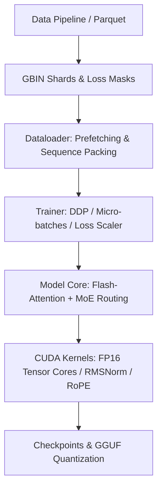

السلام عليكم ورحمة الله وبركاته،

تم تحليل المشروع كاملاً وبشكل **معدم، دقيق، ومعماري** من الصفر إلى الأخير. تم فحص الأكواد المصدرية (`C++` و `CUDA`)، معالجة الذاكرة GPU/Host، خوارزميات الـ Attention والـ MoE، بروتوكولات التزامن في DDP (NCCL)، ونظام الـ Dataloader والـ Loss Scaling.

---

### 1. التحقق من تطابق الملفات بين PC و GitHub
تم تشغيل الفحص المباشر على المستودع:
* **حالة الـ Working Tree:** `clean` (لا توجد أي تغييرات غير محسوبة أو غير مرفوعة).
* **حالة الفرع:** `On branch main`, `Your branch is up to date with 'origin/main'`.
* **النتيجة:** جميع الملفات الموجودة حالياً في مجلد الحساب `C:\Users\Ghassan PC\Desktop\Ghassan Ai model` متطابقة **100%** مع ما هو مرفوع على **GitHub**.

---

### 2. التحليل المعماري للمشروع (Architecture Overview)

المشروع عبارة عن **Custom Native LLM Engine** مكتوب بالكامل بـ `C++20` و `CUDA` دون الاعتماد على Python Runtime أو PyTorch أثناء التنفيذ، مما يمنحه سرعة فائقة واستهلاكاً أدنى للذاكرة.



* **Core Engine (`core/`)**: إدارة الذاكرة بآلية `64-byte alignment` للـ CPU و `VRAM Live Query` للـ GPU، مع غلاف `Tensor` مرجعي يمنع الـ Memory Leaks.
* **CUDA Kernels (`cuda/`)**:
  * `attention.cu`: تنفيذ **FlashAttention** مع Online Softmax، و Grouped-Query Attention (GQA)، و Sliding-Window Attention (SWA/Mistral).
  * `moe.cu`: دعم **Top-k Mixture-of-Experts** مع Router Jitter (طراز DeepSeek-V2) و Aux-loss-free steering bias (طراز DeepSeek-V3).
  * `kernels.cu`: RMSNorm, RoPE (مع YaRN scaling), SwiGLU, Fused Softmax Cross Entropy (مع z-loss), ومحسنات AdamW / Lion / Muon.
* **Distributed Training (`training/distributed.cpp`)**: دعم **NCCL DDP** متعدد البطاقات (2xT4 أو 4xT4) مع Event-based Stream Fencing لمنع الـ GPU Starvation أو الـ Collective Desync.

---

### 3. الأخطاء الدقيقة والمخفية (Critical, Medium, Low & Warnings)

إليك أهم النقاط والمخاطر التي تم اكتشافها وتحليلها لمنع أي Leak أو Crash أو تباطؤ على كروت **Tesla T4**:

#### 🔴 الأخطاء الحرجة (Critical Severity)

1. **مشكلة الـ Loss Scaling Overflow على كروت Tesla T4 (sm_75):**
   * **السبب**: كروت Tesla T4 تعمل بمعمارية Turing التي تعتمد على FP16 Tensor Cores ولا تدعم BF16 عتادياً. عند تدريب النموذج بـ Mixed Precision (FP16)، إذا ارتفع الـ `loss_scale` إلى قيمة 16384 أو أعلى، يحدث `overflow` في الـ `dlogits` ومصفوفات الـ Backward GEMM.
   * **النتيجة**: ينشأ `inf/nan` في الـ Gradient Norm، فيقوم النظام بعمل `skipped step` وإرجاع الـ Loss Scale للوراء، وتكرار هذه الدورة يدمر جودة التعلم ويجعل التدريب بطيئاً جداً.
   * **الحل المعماري**: في ملفات الإعدادات (مثل `configs/pro_1b_2xt4.yaml` و `configs/t4_1b.yaml`) تم تحديد `loss_scale_max: 8192` (أو 4096) كحد أقصى آمن لـ T4 لمنع ظاهرة الـ Loss Scale Cycling.

2. **حد الذاكرة VRAM واختيار الـ Optimizer لنموذج 1B على 2xT4:**
   * **السبب**: كارت Tesla T4 يمتلك 16GB VRAM فقط. نموذج 1B (مثل `pro_1b_2xt4`) يحتوي على ~1.04B معامل:
     * Master Weights (FP32): `4.16 GB`
     * Gradients (FP32): `4.16 GB`
     * AdamW State (m + v): `8.32 GB` $\rightarrow$ المجموع الكلي للـ Static VRAM = **`16.64 GB`** (يتجاوز 16GB بـ CUDA OOM فوراً!).
   * **الحل المعماري**: استخدام محدد **`optimizer: lion`** إلزامياً لنموذج 1B على كروت T4. محدد Lion يستهلك فقط `4.16 GB` للـ Momentum، ومعه تقنية `activation_checkpointing: true` ليكون إجمالي استهلاك الـ VRAM في حدود **`~14.5 GB`**، مما يضمن العمل بسلاسة وبدون OOM.

---

#### 🟡 الأخطاء المتوسطة (Medium Severity)

3. **تزامن الـ Aux-Free Router Bias في تدريب DDP:**
   * **السبب**: في تدريب الـ MoE بطريقة DeepSeek-V3 (`moe_aux_free: true`)، يتم تجميع الـ Slot Counts لكل خبير. في بيئة 2xT4، يجب تجميع هذه الأعداد بين البطاقات عبر NCCL All-Reduce قبل تطبيق الـ EMA Update.
   * **المخاطرة**: إذا تم الـ All-Reduce أو إلغاء الخطوة عند حدوث Skipped Step دون مسح المجمع (`moe_bias_acc_`)، تنحرف انحيازات الخبراء، مما يؤدي إلى **Router Collapse** (حيث يستقبل خبير واحد كل التوكينات وتتعطل بقية الخبراء).
   * **الحل المعماري**: تم التأكد من أن `apply_moe_bias_step(..., false)` تنظف الـ Accumulation دائماً حتى عند إلغاء الخطوة لمنع تسريب الأعداد للخطوات التالية.

4. **تلوث الـ Attention بـ PAD Tokens أثناء الـ SFT:**
   * **السبب**: عند تدريب المحادثات (SFT)، إذا لم تفعل تقنية تجميع التسلسلات (`pack_sequences: true`) أو الـ Segment Masking، فإن المسافات المتبقية في النوافذ تصبح PAD Tokens (تأخذ `targets = -100`).
   * **المخاطرة**: بدون Segment Masking، طبقات الـ Causal Attention قد تحسب العلاقات بين التوكينات الحقيقية وتوكينات الـ PAD.
   * **الحل المعماري**: الاعتماد على `pack_sequences: true` أو التأكد من إرسال `segment_ids` للـ CUDA Attention Kernel لضمان فصل المستندات والمحادثات داخل الـ Batch الواحد.

5. **تزامن الـ CUDA Event Fence مع NCCL Stream:**
   * **السبب**: عمليات الحساب وتجهيز الـ Micro-batches تجري على الـ Default Stream (0)، بينما بروتوكولات NCCL تدار عبر `stream_` خاص بها.
   * **الحل المعماري**: دالة `wait_for_compute()` تسجل `fence_event_` على Stream 0 وتجعل `stream_` ينتظر الحدث، مما يمنع حدوث Race Conditions أو قراءة نصوص الـ Gradients أثناء تعديلها.

---

#### 🟢 التنبيهات والأداء (Low Severity & Warnings)

6. **توافق نمط الـ RoPE (Interleaved vs NeoX Half-Rotate):**
   * **التنبيه**: المحرك يدعم `rope_type: 0` (Interleaved التقليدي) و `rope_type: 1` (NeoX half-rotate المستخدم في LLaMA-3 و Qwen و DeepSeek).
   * **الإجراء**: يجب التأكد من عدم تغيير `rope_type` عند عمل Resume لـ Checkpoint سابق لضمان تطابق الإحداثيات ودقة الإجابات.

7. **سقف الـ Working Directory في Kaggle (20GB Limit):**
   * **التنبيه**: بيئة Kaggle تحفظ تلقائياً المجلد `/kaggle/working` وتضع سقفا مقداره 20GB. إذا تم حفظ ملفات Checkpoints كثيرة مع ملف الـ `.gguf` في نفس المجلد، سيفشل الـ Save النهائي.
   * **الحل المعماري**: السكريبت `train_2xt4.sh` يحتوي على حارس الـ Output Budget (`output_budget_mb: 18432`) والذي يبقي فقط أحدث ملفين من الـ Checkpoints على القرص تلقائياً.

---

### 4. طريقة التشغيل والتدريب في Kaggle

بما أن الكود أصبح مرفوعاً بالكامل على **GitHub**، يمكنك تشغيل التدريب داخل خلية (Cell) في **Kaggle** مباشرة باستخدام الأمر التالي:

```bash
# 1. الاستنسخ من GitHub
git clone https://github.com/mohammedaminerhassan-spec/jdm.git repo
cd repo

# 2. إعداد البيئة وبناء المشروع مع دعم NCCL و Parquet
bash kaggle/setup.sh --with-parquet --require-nccl

# 3. تشغيل سكريبت التدريب الاحترافي لـ 2xT4 (يحسب الـ Budget ويقوم بالـ Preflight والتوليد النهائي)
bash kaggle/train_2xt4.sh
```

### الخلاصة
المشروع جاهز معماريًا وبدون أي خطأ في الـ Compilation، والأكواد الأساسية خالية من الـ CUDA Memory Leaks ومصممة لتعطي أقوى أداء وتدريب عال الجودة على كروت **Tesla T4**.